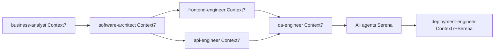
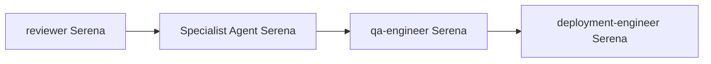
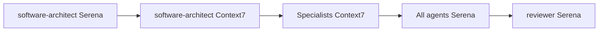

# AI Development Tools Usage Guide

## 🤖 Overview

This guide explains how to effectively use **Serena** and **Context7** with the Claude Code Agent Framework for enhanced development productivity.

## 🛠️ Tool Comparison

### Serena - Code Navigation & Intelligent Editing
**Best for**: Working with existing codebases, targeted improvements, analysis

- ✅ **Code navigation** and symbol search across large codebases
- ✅ **Intelligent refactoring** of existing code
- ✅ **Debugging and analysis** of current implementations  
- ✅ **Test execution** and build automation
- ✅ **Code review** and quality assessment
- ✅ **Real-time editing** with language server integration
- ✅ **Project structure** understanding and dependency tracking

### Context7 - Advanced Code Generation & Migrations  
**Best for**: Creating new code, large-scale transformations, scaffolding

- ✅ **Code generation** from requirements and specifications
- ✅ **Complex migrations** between frameworks or versions
- ✅ **Multi-file scaffolding** for new features or modules
- ✅ **Architecture implementation** from design documents
- ✅ **Database schema generation** and migration scripts
- ✅ **API endpoint creation** with full CRUD operations
- ✅ **Documentation generation** and template creation
- ✅ **Infrastructure-as-Code** generation for deployments

## 🎯 Agent-Specific Tool Usage

### Phase 1: Business Discovery & Analysis

**business-analyst**
- **Serena**: Analyze existing business logic and data flows
- **Context7**: Generate business process documentation and requirement templates

**product-manager**  
- **Serena**: Review existing features and their implementations
- **Context7**: Create user story templates, acceptance criteria, and roadmap documentation

**ux-designer**
- **Serena**: Analyze current UI components and user interaction patterns
- **Context7**: Generate user journey documentation, persona templates, and design system specs

**reviewer**
- **Both tools**: Comprehensive analysis combining existing code review with generated documentation

### Phase 2: Architecture & UX Design

**software-architect**
- **Serena**: Analyze existing architecture patterns and dependencies
- **Context7**: Generate architecture documentation, system diagrams, and design patterns

**ux-designer**
- **Serena**: Review existing design components and accessibility compliance
- **Context7**: Generate design system components, style guides, and accessibility templates

**security-engineer**
- **Serena**: Analyze existing security implementations and vulnerabilities
- **Context7**: Generate security policies, configuration templates, and compliance documentation

**data-engineer**
- **Serena**: Analyze current data models and query performance
- **Context7**: Generate data schema, ETL pipeline templates, and analytics documentation

### Phase 3: Development & Continuous QA

**frontend-engineer**
- **Serena**: Navigate component hierarchies, debug UI issues, optimize performance
- **Context7**: Generate new components, responsive layouts, and UI test suites

**api-engineer**
- **Serena**: Debug API endpoints, optimize database queries, analyze service dependencies
- **Context7**: Generate REST/GraphQL APIs, microservice templates, and integration tests

**data-engineer**
- **Serena**: Optimize existing queries, debug ETL processes, analyze data quality
- **Context7**: Generate migration scripts, data pipelines, and analytics dashboards

**security-engineer**
- **Serena**: Audit existing security controls, analyze authentication flows
- **Context7**: Generate security configurations, authentication systems, and monitoring rules

**qa-engineer**
- **Serena**: Execute tests, debug failures, analyze code coverage
- **Context7**: Generate comprehensive test suites, mock data, and test automation frameworks

### Phase 4: Deployment & Operations

**deployment-engineer**
- **Serena**: Monitor deployment configurations, debug infrastructure issues
- **Context7**: Generate CI/CD pipelines, Docker configurations, and Kubernetes manifests

### Phase 5: Monitoring & Continuous Improvement

**All agents**
- **Serena**: Analyze performance metrics, debug production issues
- **Context7**: Generate monitoring documentation, runbooks, and improvement reports

## 🔄 Collaborative Workflows

### New Feature Development



1. **business-analyst** (Context7): Generate requirement documentation
2. **software-architect** (Context7): Generate architecture specs and patterns
3. **frontend-engineer** (Context7): Generate component scaffolding and tests
4. **api-engineer** (Context7): Generate API endpoints and integration tests
5. **qa-engineer** (Context7): Generate comprehensive test suites
6. **All agents** (Serena): Refine, debug, and optimize implementations
7. **deployment-engineer** (Context7 + Serena): Generate deployment configs and deploy

### Bug Fix & Maintenance



1. **reviewer** (Serena): Analyze issue scope and impact
2. **Specialist agent** (Serena): Navigate, debug, and fix code
3. **qa-engineer** (Serena): Validate fix and run regression tests
4. **deployment-engineer** (Serena): Deploy and monitor

### Major Refactoring



1. **software-architect** (Serena): Analyze current architecture and pain points
2. **software-architect** (Context7): Generate new architecture documentation and migration plan
3. **Specialist agents** (Context7): Generate new structure and scaffolding
4. **All agents** (Serena): Migrate existing code and validate changes
5. **reviewer** (Serena): Final quality review and validation

## 📋 Best Practices

### When to Use Serena

**Perfect for:**
- 🔍 Exploring unfamiliar codebases
- 🐛 Debugging specific issues
- ⚡ Making targeted improvements
- 🧪 Running and debugging tests
- 📊 Analyzing code quality and performance
- 🔄 Incremental refactoring

**Workflow pattern:**
1. Navigate to relevant code sections
2. Analyze current implementation
3. Make precise, targeted changes
4. Validate with tests
5. Monitor impact

### When to Use Context7

**Perfect for:**
- 🆕 Creating new features from scratch
- 🏗️ Scaffolding entire modules or services
- 📝 Generating comprehensive documentation
- 🔄 Large-scale code transformations
- 🗄️ Database schema changes and migrations
- 🔧 Infrastructure setup and configuration

**Workflow pattern:**
1. Define requirements and specifications
2. Generate initial implementation
3. Customize generated code for specific needs
4. Integrate with existing systems
5. Document and test generated components

### Combining Both Tools

**Hybrid workflows:**
1. **Context7** → **Serena**: Generate code, then refine and optimize
2. **Serena** → **Context7**: Analyze existing patterns, then generate similar components
3. **Context7** → **Serena** → **Context7**: Generate base, analyze gaps, generate improvements

## ⚙️ Configuration Management

### Environment Variables

```bash
# AI Tools Configuration
USE_SERENA=true
USE_CONTEXT7=true
SERENA_PROJECT_PATH=.serena/project.yml
CONTEXT7_CONFIG_PATH=.claude/templates/context7/ai-tools-config.md
AI_ASSISTED_DEVELOPMENT=true
```

### Agent Integration Settings

In `CLAUDE.md`, add to Project Metadata section:

```markdown
## 0. Project Metadata
- **serena_enabled**: true/false
- **context7_enabled**: true/false
- **ai_workflow_preference**: serena_first | context7_first | balanced
```

### Tool Selection Decision Tree

```
New code needed?
├─ Yes → Context7 for generation
│   └─ Then Serena for refinement
└─ No → Existing code work?
    ├─ Yes → Serena for analysis/editing
    └─ No → Documentation/Migration?
        ├─ Yes → Context7 for generation
        └─ No → Use both as appropriate
```

## 🚀 Quick Start Commands

### For Serena Users
```bash
# Initialize Serena in existing project
serena onboarding

# Activate project context
serena activate

# Run with agent context
serena chat "Use the software-architect agent to analyze our current architecture"
```

### For Context7 Users
```bash
# Generate new component with agent context  
context7 generate component "Create a UserProfile component following our frontend-engineer specifications"

# Generate migration script
context7 migrate "Generate database migration following our data-engineer patterns"

# Generate documentation
context7 docs "Create API documentation using our api-engineer standards"
```

## 📈 Success Metrics

Track effectiveness through:
- **Development Speed**: Time from requirement to implementation
- **Code Quality**: Reduced bugs, improved test coverage
- **Consistency**: Adherence to architectural patterns
- **Knowledge Transfer**: Documentation completeness
- **Developer Experience**: Reduced context switching, faster onboarding

---

**Remember**: The goal is to amplify human creativity and productivity, not replace human judgment. Use AI tools to handle repetitive tasks while focusing your expertise on critical decisions and complex problem-solving.