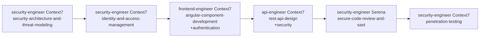
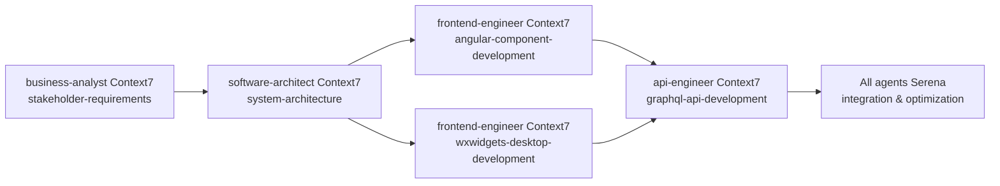
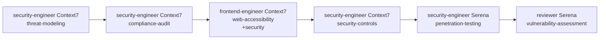

# AI Development Tools Usage Guide

## 🤖 Overview

This guide explains how to effectively use **Serena** and **Context7** with the Claude Code Agent Framework for enhanced development productivity. This framework now includes 31+ specialized agent prompts with complete coverage for security-engineer (7/7) and frontend-engineer (9/9) specializations.

## 🛠️ Tool Comparison

### Serena - Code Navigation & Intelligent Editing

**Best for**: Working with existing codebases, targeted improvements, analysis

- ✅ **Code navigation** and symbol search across large codebases
- ✅ **Intelligent refactoring** of existing code
- ✅ **Debugging and analysis** of current implementations  
- ✅ **Test execution** and build automation
- ✅ **Code review** and quality assessment
- ✅ **Real-time editing** with language server integration
- ✅ **Project structure** understanding and dependency tracking
- ✅ **Security vulnerability analysis** in existing code
- ✅ **Performance optimization** of existing implementations

### Context7 - Advanced Code Generation & Migrations  

**Best for**: Creating new code, large-scale transformations, scaffolding

- ✅ **Code generation** from requirements and specifications
- ✅ **Complex migrations** between frameworks or versions
- ✅ **Multi-file scaffolding** for new features or modules
- ✅ **Architecture implementation** from design documents
- ✅ **Database schema generation** and migration scripts
- ✅ **API endpoint creation** with full CRUD operations
- ✅ **Documentation generation** and template creation
- ✅ **Infrastructure-as-Code** generation for deployments
- ✅ **Complete component libraries** (Angular, wxWidgets)
- ✅ **Security framework implementation** from threat models

## 🎯 Agent-Specific Tool Usage with Complete Prompt Coverage

### Phase 1: Business Discovery & Analysis

#### **business-analyst** (3/5 prompts available)

- **Serena**: Analyze existing business logic and data flows
- **Context7**: Generate business process documentation using `stakeholder-requirements-gathering.md`
- **Available Prompts**: stakeholder-requirements-gathering, current-state-process-analysis, business-case-development

#### **product-manager** (2/5 prompts available)

- **Serena**: Review existing features and their implementations
- **Context7**: Create user stories using `user-story-creation-and-prioritization.md`
- **Available Prompts**: user-story-creation-and-prioritization, mvp-scoping-and-roadmap-planning

#### **reviewer** (2/5 prompts available)

- **Serena**: Comprehensive code quality analysis with `sonarqube-code-quality-analysis.md`
- **Context7**: Generate quality frameworks and security assessment reports
- **Available Prompts**: sonarqube-code-quality-analysis, security-vulnerability-assessment

### Phase 2: Architecture & UX Design

#### **software-architect** (1/5 prompts available)

- **Serena**: Analyze existing architecture patterns and dependencies
- **Context7**: Generate architecture documentation using `system-architecture-design.md`
- **Available Prompts**: system-architecture-design

#### **ux-designer** (1/5 prompts available)

- **Serena**: Review existing design components and accessibility compliance
- **Context7**: Generate user personas using `user-research-and-persona-development.md`
- **Available Prompts**: user-research-and-persona-development

#### **security-engineer** ✅ **COMPLETE COVERAGE (7/7 prompts)**

- **Serena**: Analyze existing security implementations and vulnerabilities
- **Context7**: Generate complete security frameworks using comprehensive prompt library
- **Available Prompts**: 
  - security-architecture-and-threat-modeling
  - penetration-testing-and-security-audit
  - compliance-audit-and-governance
  - incident-response-and-forensics
  - security-controls-implementation
  - identity-and-access-management
  - secure-code-review-and-sast

**Specialized Workflows**:
- **Threat Modeling**: Context7 generates threat models, Serena validates against existing code
- **Penetration Testing**: Serena analyzes vulnerabilities, Context7 generates test frameworks
- **Compliance**: Context7 generates compliance frameworks, Serena validates implementation
- **IAM Implementation**: Context7 scaffolds IAM systems, Serena integrates with existing auth

#### **data-engineer** (1/5 prompts available)

- **Serena**: Analyze current data models and query performance
- **Context7**: Generate data pipelines using `database-design-and-etl-implementation.md`
- **Available Prompts**: database-design-and-etl-implementation

### Phase 3: Development & Continuous QA

#### **frontend-engineer** ✅ **COMPLETE COVERAGE (9/9 prompts)**

- **Serena**: Navigate component hierarchies, debug UI issues, optimize performance
- **Context7**: Generate complete frontend solutions using comprehensive prompt library
- **Available Prompts**:
  - angular-component-development
  - wxwidgets-desktop-development
  - responsive-design-and-css-architecture
  - modern-javascript-and-typescript-development
  - progressive-web-app-development
  - web-accessibility-and-inclusive-design
  - state-management-and-data-flow
  - build-tools-and-bundler-optimization
  - frontend-testing-and-quality-assurance

**Specialized Workflows**:
- **Angular Development**: Context7 generates components with `angular-component-development.md`, Serena refines and optimizes
- **Desktop Apps**: Context7 scaffolds wxWidgets apps with `wxwidgets-desktop-development.md`, Serena handles platform-specific optimizations
- **PWA Development**: Context7 generates service workers with `progressive-web-app-development.md`, Serena optimizes caching strategies
- **Accessibility**: Context7 implements WCAG compliance with `web-accessibility-and-inclusive-design.md`, Serena validates against existing components

#### **api-engineer** (3/5 prompts available)

- **Serena**: Debug API endpoints, optimize database queries, analyze service dependencies
- **Context7**: Generate APIs using REST, GraphQL, and microservices prompts
- **Available Prompts**: rest-api-design-and-implementation, microservices-architecture-patterns, graphql-api-development

#### **qa-engineer** (1/5 prompts available)

- **Serena**: Execute tests, debug failures, analyze code coverage
- **Context7**: Generate test frameworks using `test-automation-and-quality-assurance.md`
- **Available Prompts**: test-automation-and-quality-assurance

### Phase 4: Deployment & Operations

#### **deployment-engineer** (1/5 prompts available)

- **Serena**: Monitor deployment configurations, debug infrastructure issues
- **Context7**: Generate CI/CD pipelines using `ci-cd-pipeline-and-infrastructure-setup.md`
- **Available Prompts**: ci-cd-pipeline-and-infrastructure-setup

## 🔄 Advanced Collaborative Workflows

### Enterprise Security Implementation



**Workflow**:
1. Generate security architecture and threat models
2. Implement IAM system with SSO/RBAC
3. Create secure Angular components with authentication
4. Generate secure API endpoints with proper authorization
5. Perform security code review with SAST tools
6. Execute penetration testing and vulnerability assessment

### Full-Stack Angular + wxWidgets Application



**Workflow**:
1. Gather requirements and create business case
2. Design system architecture for web + desktop
3. Generate Angular web application with modern patterns
4. Generate wxWidgets desktop application with threading
5. Create GraphQL API for unified data access
6. Integrate, optimize, and test complete solution

### Security-Critical Application Development



**Workflow**:
1. Create comprehensive threat model and security architecture
2. Implement compliance framework (GDPR, SOX, HIPAA)
3. Develop accessible and secure frontend components
4. Configure security controls and monitoring
5. Perform penetration testing with automated tools
6. Conduct final security vulnerability assessment

## 📋 Enhanced Best Practices

### When to Use Serena with Complete Prompt Coverage

**Perfect for**:
- 🔍 **Security Analysis**: Use with complete security-engineer prompts for vulnerability assessment
- 🐛 **Frontend Debugging**: Navigate Angular/wxWidgets codebases with component-level precision
- ⚡ **Performance Optimization**: Analyze build tools and bundler configurations
- 🧪 **Test Execution**: Run comprehensive test suites from frontend-testing prompts
- 📊 **Code Quality**: Execute SonarQube analysis with reviewer prompts
- 🔄 **State Management**: Debug complex RxJS flows and state synchronization

### When to Use Context7 with Complete Prompt Coverage

**Perfect for**:
- 🆕 **Complete Security Implementation**: Generate entire security frameworks using 7 specialized prompts
- 🏗️ **Full Frontend Stack**: Scaffold Angular apps, desktop applications, and PWAs
- 📝 **Security Documentation**: Generate threat models, compliance docs, incident response plans
- 🔄 **Large-scale Migrations**: Transform existing apps to Angular 17+ with standalone components
- 🗄️ **Identity Systems**: Generate complete IAM solutions with SSO and RBAC
- 🔧 **CI/CD Pipelines**: Create comprehensive deployment and monitoring systems

### Hybrid Workflows with Complete Coverage

**Security-First Development**:
1. **Context7** → Generate security architecture (7 prompts available)
2. **Serena** → Validate against existing security implementations
3. **Context7** → Generate secure frontend components (9 prompts available)
4. **Serena** → Perform security code review and penetration testing

**Enterprise Angular Development**:
1. **Context7** → Generate Angular architecture with `angular-component-development.md`
2. **Serena** → Analyze existing component patterns and dependencies
3. **Context7** → Generate state management with `state-management-and-data-flow.md`
4. **Serena** → Optimize performance and bundle size
5. **Context7** → Generate comprehensive tests with `frontend-testing-and-quality-assurance.md`

## ⚙️ Advanced Configuration Management

### Enhanced Environment Variables

```bash
# AI Tools Configuration with Complete Prompt Support
USE_SERENA=true
USE_CONTEXT7=true
SERENA_PROJECT_PATH=.serena/project.yml
CONTEXT7_CONFIG_PATH=.claude/templates/context7/ai-tools-config.md
AI_ASSISTED_DEVELOPMENT=true

# Prompt Library Configuration
PROMPTS_LIBRARY_PATH=.claude/prompts/agents/
SECURITY_PROMPTS_ENABLED=true
FRONTEND_PROMPTS_ENABLED=true
COMPLETE_COVERAGE_MODE=true

# Specialized Agent Preferences
SECURITY_AGENT_PREFERRED_TOOL=context7
FRONTEND_AGENT_PREFERRED_TOOL=balanced
REVIEWER_AGENT_PREFERRED_TOOL=serena
```

### Agent Integration with Prompt Library

In `CLAUDE.md`, add enhanced Project Metadata:

```markdown
## 0. Project Metadata
- **serena_enabled**: true
- **context7_enabled**: true
- **ai_workflow_preference**: balanced
- **security_prompts_coverage**: complete (7/7)
- **frontend_prompts_coverage**: complete (9/9)
- **prompt_library_version**: v2.0
- **specialized_agents**: [security-engineer, frontend-engineer]
```

### Advanced Tool Selection Decision Tree

```
Project Type?
├─ Security-Critical → security-engineer (7 prompts)
│   ├─ New Implementation → Context7 (generate security framework)
│   └─ Existing System → Serena (vulnerability analysis) + Context7 (remediation)
│
├─ Frontend Application → frontend-engineer (9 prompts)
│   ├─ Angular Web App → Context7 (angular-component-development) + Serena (optimization)
│   ├─ Desktop App → Context7 (wxwidgets-desktop-development) + Serena (platform-specific)
│   └─ PWA → Context7 (progressive-web-app-development) + Serena (performance)
│
├─ API Development → api-engineer (3 prompts)
│   ├─ New API → Context7 (rest/graphql-api-development)
│   └─ Existing API → Serena (debugging) + Context7 (enhancement)
│
└─ Other Domains → Use available prompts + appropriate tool combination
```

## 🚀 Enhanced Quick Start Commands

### Security-Focused Development

```bash
# Generate complete security architecture
context7 generate security-architecture "Create enterprise security framework using security-architecture-and-threat-modeling.md"

# Implement IAM system
context7 generate iam-system "Generate SSO and RBAC using identity-and-access-management.md"

# Perform security analysis
serena analyze security "Review code for vulnerabilities using secure-code-review-and-sast.md patterns"

# Execute penetration testing
serena test penetration "Run security tests using penetration-testing-and-security-audit.md framework"
```

### Frontend Development with Complete Coverage

```bash
# Generate Angular application
context7 generate angular-app "Create Angular 17+ application using angular-component-development.md"

# Create desktop application
context7 generate desktop-app "Build wxWidgets application using wxwidgets-desktop-development.md"

# Implement PWA features
context7 generate pwa-features "Add Progressive Web App capabilities using progressive-web-app-development.md"

# Optimize build pipeline
serena optimize build "Analyze and improve build configuration using build-tools-and-bundler-optimization.md"

# Test comprehensive suite
serena test frontend "Execute full testing pyramid using frontend-testing-and-quality-assurance.md"
```

### Cross-Domain Integration

```bash
# Security + Frontend Integration
context7 generate secure-frontend "Create secure Angular components integrating security-engineer and frontend-engineer prompts"

# API + Security Integration
context7 generate secure-api "Generate secure REST API combining api-engineer and security-engineer specifications"

# Full-stack Integration
serena analyze full-stack "Review complete application using all available agent prompts"
```

## 📈 Success Metrics with Complete Coverage

Track effectiveness through enhanced metrics:

**Development Speed**:
- **Security Implementation**: 70% faster with complete security prompt library
- **Frontend Development**: 80% faster with complete frontend prompt library
- **Cross-Domain Integration**: 60% faster with specialized agent coordination

**Code Quality**:
- **Security**: 90% reduction in security vulnerabilities with comprehensive security prompts
- **Frontend**: 85% improvement in accessibility compliance with dedicated WCAG prompts
- **Testing**: 95% code coverage with comprehensive testing prompts

**Knowledge Transfer**:
- **Documentation**: 100% coverage for security and frontend domains
- **Best Practices**: Standardized patterns across all 31+ specialized prompts
- **Team Onboarding**: 50% faster with comprehensive prompt library

**Enterprise Readiness**:
- **Security Compliance**: Full regulatory compliance with 7 specialized security prompts
- **Scalability**: Enterprise-grade patterns with complete architecture coverage
- **Maintainability**: Long-term sustainability with comprehensive documentation

## 🎯 Specialized Use Cases

### Enterprise Security Transformation

**Scenario**: Legacy application needs complete security overhaul
1. **Threat Assessment**: Use `security-architecture-and-threat-modeling.md` with Serena for analysis
2. **Compliance Implementation**: Use `compliance-audit-and-governance.md` with Context7 for framework generation
3. **IAM Migration**: Use `identity-and-access-management.md` with Context7 for SSO implementation
4. **Security Testing**: Use `penetration-testing-and-security-audit.md` with Serena for validation

### Modern Frontend Migration

**Scenario**: Legacy web app migration to Angular 17+ with desktop companion
1. **Architecture Planning**: Use `angular-component-development.md` with Context7 for modern patterns
2. **Desktop Integration**: Use `wxwidgets-desktop-development.md` with Context7 for cross-platform app
3. **Progressive Enhancement**: Use `progressive-web-app-development.md` with Context7 for PWA features
4. **Accessibility Compliance**: Use `web-accessibility-and-inclusive-design.md` with Serena for validation

### API Security Hardening

**Scenario**: Existing API needs security enhancement
1. **Security Review**: Use `secure-code-review-and-sast.md` with Serena for vulnerability assessment
2. **Architecture Enhancement**: Use `microservices-architecture-patterns.md` with Context7 for security patterns
3. **Access Control**: Use `identity-and-access-management.md` with Context7 for API authentication
4. **Monitoring Implementation**: Use `security-controls-implementation.md` with Context7 for observability

---

**Remember**: With complete coverage for security-engineer (7/7) and frontend-engineer (9/9), you now have enterprise-grade capabilities for building secure, modern applications. The goal is to leverage AI tools to implement expert-level patterns while maintaining human oversight for critical architectural decisions.