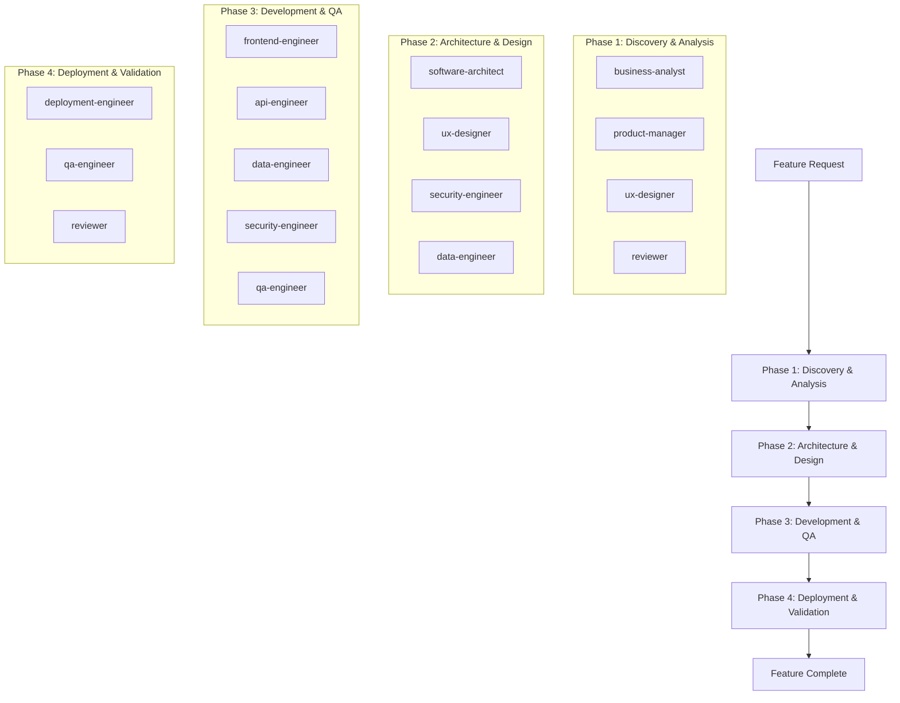

# New Feature Development Orchestration

**Workflow Type: Complete Feature Development**
**Purpose: Orchestrate multi-agent collaboration for developing new features from conception to production**

---

## 🎯 Mission

Coordinate all agents in a systematic approach to deliver high-quality features that meet business requirements, user needs, and technical standards while maintaining project timelines and quality gates.

## 📋 Orchestration Overview

### Feature Development Phases


## 🚀 Detailed Orchestration Instructions

### Phase 1: Business Discovery & Analysis (Days 1-3)

**Step 1.1: Requirements Gathering** 
```yaml
agent: business-analyst
prompt: stakeholder-requirements-gathering.md
parallel_with: []
inputs:
  - feature_request_document
  - stakeholder_list
  - business_context
outputs:
  - business_requirements_document
  - stakeholder_matrix
  - success_criteria
duration: 2 days
```

**Step 1.2: Product Strategy & Prioritization**
```yaml
agent: product-manager
prompt: user-story-creation-and-prioritization.md
parallel_with: [Step 1.3]
depends_on: [Step 1.1]
inputs:
  - business_requirements_document
  - current_product_roadmap
  - user_feedback_data
outputs:
  - user_stories_backlog
  - feature_priority_matrix
  - mvp_scope_definition
duration: 1 day
```

**Step 1.3: User Research & Validation**
```yaml
agent: ux-designer
prompt: user-research-and-persona-development.md
parallel_with: [Step 1.2]
depends_on: [Step 1.1]
inputs:
  - business_requirements_document
  - existing_user_personas
  - user_analytics_data
outputs:
  - updated_user_personas
  - user_journey_maps
  - usability_requirements
duration: 1 day
```

**Step 1.4: Requirements Validation**
```yaml
agent: reviewer
prompt: stakeholder-approval-coordination.md  # To be created
parallel_with: []
depends_on: [Step 1.2, Step 1.3]
inputs:
  - business_requirements_document
  - user_stories_backlog
  - user_journey_maps
outputs:
  - validated_requirements
  - stakeholder_signoff
  - phase_2_readiness_report
duration: 0.5 days
```

### Phase 2: Architecture & UX Design (Days 4-7)

**Step 2.1: System Architecture Design**
```yaml
agent: software-architect
prompt: system-architecture-design.md
parallel_with: [Step 2.2]
depends_on: [Phase 1 Complete]
inputs:
  - validated_requirements
  - existing_system_architecture
  - non_functional_requirements
outputs:
  - feature_architecture_design
  - technology_stack_updates
  - integration_specifications
duration: 2 days
```

**Step 2.2: UX Design & Prototyping**
```yaml
agent: ux-designer
prompt: design-system-and-prototyping.md  # To be created
parallel_with: [Step 2.1, Step 2.3]
depends_on: [Phase 1 Complete]
inputs:
  - user_journey_maps
  - usability_requirements
  - design_system_library
outputs:
  - wireframes_and_mockups
  - interactive_prototypes
  - design_specifications
duration: 2 days
```

**Step 2.3: Security Architecture Review**
```yaml
agent: security-engineer
prompt: security-architecture-and-threat-modeling.md
parallel_with: [Step 2.2, Step 2.4]
depends_on: [Step 2.1 - Architecture Draft]
inputs:
  - feature_architecture_design
  - security_requirements
  - threat_model_templates
outputs:
  - security_architecture_design
  - threat_assessment_report
  - security_controls_specification
duration: 1 day
```

**Step 2.4: Data Architecture Planning**
```yaml
agent: data-engineer
prompt: database-design-and-etl-implementation.md
parallel_with: [Step 2.3]
depends_on: [Step 2.1 - Architecture Draft]
inputs:
  - feature_architecture_design
  - data_requirements
  - existing_data_models
outputs:
  - data_model_design
  - database_migration_plan
  - analytics_requirements
duration: 1 day
```

**Step 2.5: Architecture & Design Validation**
```yaml
agent: reviewer
prompt: architecture-compliance-validation.md  # To be created
parallel_with: []
depends_on: [Step 2.1, Step 2.2, Step 2.3, Step 2.4]
inputs:
  - feature_architecture_design
  - design_specifications
  - security_architecture_design
  - data_model_design
outputs:
  - validated_architecture
  - design_approval
  - phase_3_readiness_report
duration: 1 day
```

### Phase 3: Development & Continuous QA (Days 8-15)

**Step 3.1: Test Framework Setup**
```yaml
agent: qa-engineer
prompt: test-automation-and-quality-assurance.md
parallel_with: []
depends_on: [Phase 2 Complete]
inputs:
  - validated_architecture
  - user_stories_backlog
  - acceptance_criteria
outputs:
  - test_strategy_document
  - test_automation_framework
  - quality_gates_configuration
duration: 1 day
```

**Step 3.2: Frontend Development**
```yaml
agent: frontend-engineer
prompt: react-component-development-and-testing.md
parallel_with: [Step 3.3, Step 3.4]
depends_on: [Step 3.1, Phase 2 Complete]
inputs:
  - design_specifications
  - component_requirements
  - api_contracts  # From Step 3.3
outputs:
  - react_components
  - frontend_tests
  - storybook_documentation
duration: 4 days
```

**Step 3.3: API Development**
```yaml
agent: api-engineer
prompt: rest-api-design-and-implementation.md
parallel_with: [Step 3.2, Step 3.4, Step 3.5]
depends_on: [Step 3.1, Phase 2 Complete]
inputs:
  - feature_architecture_design
  - data_model_design
  - security_requirements
outputs:
  - api_implementation
  - api_documentation
  - integration_tests
duration: 4 days
```

**Step 3.4: Data Implementation**
```yaml
agent: data-engineer
prompt: database-design-and-etl-implementation.md
parallel_with: [Step 3.2, Step 3.3, Step 3.5]
depends_on: [Step 3.1, Phase 2 Complete]
inputs:
  - data_model_design
  - database_migration_plan
  - analytics_requirements
outputs:
  - database_migrations
  - etl_pipelines
  - data_quality_tests
duration: 3 days
```

**Step 3.5: Security Implementation**
```yaml
agent: security-engineer
prompt: security-controls-implementation.md  # To be created
parallel_with: [Step 3.2, Step 3.3, Step 3.4]
depends_on: [Step 3.1, Phase 2 Complete]
inputs:
  - security_architecture_design
  - security_controls_specification
  - authentication_requirements
outputs:
  - security_controls_code
  - security_tests
  - vulnerability_scan_results
duration: 2 days
```

**Step 3.6: Integration Testing**
```yaml
agent: qa-engineer
prompt: integration-testing-coordination.md  # To be created
parallel_with: []
depends_on: [Step 3.2, Step 3.3, Step 3.4, Step 3.5]
inputs:
  - all_development_outputs
  - integration_test_scenarios
  - performance_requirements
outputs:
  - integration_test_results
  - performance_test_results
  - bug_reports
duration: 2 days
```

**Step 3.7: Code Quality Review**
```yaml
agent: reviewer
prompt: sonarqube-code-quality-analysis.md
parallel_with: [Step 3.8]
depends_on: [Step 3.6]
inputs:
  - all_code_implementations
  - code_quality_standards
  - test_coverage_reports
outputs:
  - code_quality_report
  - technical_debt_assessment
  - remediation_recommendations
duration: 1 day
```

**Step 3.8: Security Vulnerability Assessment**
```yaml
agent: reviewer
prompt: security-vulnerability-assessment.md
parallel_with: [Step 3.7]
depends_on: [Step 3.6]
inputs:
  - complete_feature_implementation
  - security_scan_configurations
  - threat_model
outputs:
  - vulnerability_assessment_report
  - security_remediation_plan
  - compliance_validation
duration: 1 day
```

### Phase 4: Deployment & Validation (Days 16-18)

**Step 4.1: Deployment Pipeline Setup**
```yaml
agent: deployment-engineer
prompt: ci-cd-pipeline-and-infrastructure-setup.md
parallel_with: []
depends_on: [Step 3.7, Step 3.8]
inputs:
  - validated_code_implementation
  - infrastructure_requirements
  - deployment_specifications
outputs:
  - deployment_pipeline
  - infrastructure_configuration
  - monitoring_setup
duration: 1 day
```

**Step 4.2: Production Deployment**
```yaml
agent: deployment-engineer
prompt: blue-green-deployment-execution.md  # To be created
parallel_with: [Step 4.3]
depends_on: [Step 4.1]
inputs:
  - deployment_pipeline
  - feature_implementation
  - rollback_procedures
outputs:
  - production_deployment
  - deployment_metrics
  - system_health_status
duration: 0.5 days
```

**Step 4.3: Production Testing**
```yaml
agent: qa-engineer
prompt: production-validation-testing.md  # To be created
parallel_with: [Step 4.2]
depends_on: [Step 4.1]
inputs:
  - production_environment
  - validation_test_suites
  - monitoring_dashboards
outputs:
  - production_test_results
  - performance_validation
  - user_acceptance_validation
duration: 1 day
```

**Step 4.4: Feature Validation & Sign-off**
```yaml
agent: reviewer
prompt: feature-completion-validation.md  # To be created
parallel_with: []
depends_on: [Step 4.2, Step 4.3]
inputs:
  - production_deployment_status
  - production_test_results
  - business_success_criteria
outputs:
  - feature_completion_report
  - stakeholder_sign_off
  - lessons_learned_document
duration: 0.5 days
```

## 🔄 Parallel Execution Guidelines

### Allowed Parallel Work
```yaml
parallel_execution_rules:
  phase_1:
    - user_research_and_product_strategy: true  # Steps 1.2 & 1.3
    - requirements_validation_independent: false  # Step 1.4 needs both
    
  phase_2:
    - architecture_and_ux_design: true  # Steps 2.1 & 2.2
    - security_and_data_architecture: true  # Steps 2.3 & 2.4
    - all_design_work_parallel: true  # All Step 2.x except 2.5
    
  phase_3:
    - frontend_api_data_security: true  # Steps 3.2, 3.3, 3.4, 3.5
    - quality_reviews_parallel: true  # Steps 3.7 & 3.8
    
  phase_4:
    - deployment_and_testing: true  # Steps 4.2 & 4.3
```

## 📊 Quality Gates & Success Criteria

### Phase Completion Criteria
```yaml
quality_gates:
  phase_1_complete:
    - business_requirements_validated: true
    - stakeholder_sign_off_obtained: true
    - user_research_completed: true
    - product_scope_defined: true
    
  phase_2_complete:
    - architecture_design_approved: true
    - ux_design_validated: true
    - security_review_passed: true
    - data_model_approved: true
    
  phase_3_complete:
    - code_quality_gate_passed: true
    - test_coverage_threshold_met: 85%
    - security_vulnerabilities_resolved: true
    - integration_tests_passing: 100%
    
  phase_4_complete:
    - production_deployment_successful: true
    - production_tests_passing: true
    - performance_criteria_met: true
    - feature_validation_completed: true
```

## 🚨 Risk Management & Escalation

### Common Issues & Resolutions
```yaml
risk_management:
  scope_creep:
    detection: "Requirements change requests during development"
    response: "Engage product-manager and business-analyst for impact assessment"
    escalation: "Stakeholder decision on scope vs timeline trade-offs"
    
  technical_blockers:
    detection: "Architecture or implementation challenges"
    response: "Engage software-architect and relevant development agents"
    escalation: "Consider alternative solutions or scope adjustment"
    
  quality_gate_failures:
    detection: "Code quality, security, or test failures"
    response: "Immediate remediation by responsible agents"
    escalation: "Timeline adjustment if remediation impacts delivery"
    
  integration_issues:
    detection: "Component integration failures"
    response: "Cross-agent collaboration for resolution"
    escalation: "Architecture review if fundamental design issues"
```

## 📈 Success Metrics

### Key Performance Indicators
```yaml
success_metrics:
  delivery:
    - on_time_delivery: target > 90%
    - scope_completeness: target = 100%
    - quality_gate_pass_rate: target = 100%
    
  quality:
    - code_coverage: target >= 85%
    - security_vulnerabilities: target = 0 critical/high
    - performance_criteria: target = 100% met
    
  collaboration:
    - inter_agent_handoff_efficiency: target < 24h
    - rework_rate: target < 5%
    - stakeholder_satisfaction: target >= 4.5/5
    
  business:
    - user_acceptance: target >= 90%
    - business_value_realization: target = 100%
    - feature_adoption_rate: target >= 70%
```

## 📤 Final Deliverables

Upon completion of all phases:
- ✅ **Production-ready feature** deployed and validated
- ✅ **Comprehensive documentation** including architecture, API, and user guides
- ✅ **Quality assurance reports** with test results and security validation
- ✅ **Deployment artifacts** with rollback procedures and monitoring
- ✅ **Business validation** with success metrics and stakeholder sign-off
- ✅ **Lessons learned** document for process improvement

---
*This orchestration ensures systematic, high-quality feature delivery through coordinated multi-agent collaboration while maintaining flexibility for project-specific adaptations.*