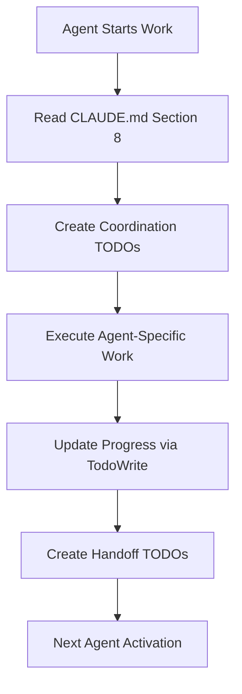

# Agent Coordination Templates - Multi-Agent TODO Management

**Purpose: Coordination patterns for seamless multi-agent TODO management and handoff protocols**

---

## 🎯 Coordination System Overview

### Agent Coordination Flow



---

## 📋 TodoWrite Coordination Patterns

### 1. **Agent Session Start Pattern**

**Functional Approach: Initialize agent coordination via TodoWrite**

```typescript
// Agent initialization TODO
TodoWrite({
  content: "Initialize [agent-name] coordination with CLAUDE.md configuration",
  status: "in_progress",
  activeForm: "Reading CLAUDE.md Section 8 and setting up coordination"
});

// Configuration validation TODO
TodoWrite({
  content: "Validate TODO management configuration for [agent-name] session",
  status: "pending",
  activeForm: "Checking TODO hierarchy and coordination settings"
});

// Coordination readiness TODO
TodoWrite({
  content: "Establish coordination readiness for multi-agent workflow",
  status: "pending",
  activeForm: "Preparing for handoffs and progress coordination"
});
```

**Usage: Agents use these patterns at session start to establish coordination**

### 2. **Agent Handoff Pattern**

**Functional Approach: Seamless agent handoffs via TodoWrite coordination**

```typescript
// Sending agent completion
TodoWrite({
  content: "Handoff [work-item] to [receiving-agent] with deliverables",
  status: "completed",
  activeForm: "Completed [work-item] and prepared handoff to [receiving-agent]"
});

// Receiving agent acknowledgment
TodoWrite({
  content: "Received [work-item] from [sending-agent] - starting next phase",
  status: "in_progress",
  activeForm: "Starting work on [work-item] from [sending-agent]"
});

// Requirements validation
TodoWrite({
  content: "Validate [work-item] requirements and deliverables",
  status: "pending",
  activeForm: "Validating requirements for [work-item]"
});

// Coordination confirmation
TodoWrite({
  content: "Confirm handoff understanding with [sending-agent]",
  status: "pending",
  activeForm: "Coordinating with [sending-agent] for clarifications"
});
```

**Usage: Standard pattern for all agent-to-agent work handoffs**

### 3. **Progress Tracking Pattern**

**Functional Approach: Progress synchronization via TodoWrite updates**

```typescript
// Daily progress update
TodoWrite({
  content: "Daily progress: [agent-work] status and coordination update",
  status: "completed",
  activeForm: "Reporting daily progress for [agent-name] activities"
});

// Cross-agent progress coordination
TodoWrite({
  content: "Coordinate progress status with dependent agents",
  status: "pending",
  activeForm: "Synchronizing progress with [related-agents]"
});

// Blocking issues identification
TodoWrite({
  content: "Identify and report any blocking issues for workflow",
  status: "pending",
  activeForm: "Checking for blockers and dependency issues"
});

// Progress milestone tracking
TodoWrite({
  content: "Track milestone completion: [milestone-description]",
  status: "completed",
  activeForm: "Achieved milestone: [milestone-name]"
});
```

**Usage: Regular progress reporting and coordination patterns**

### 4. **Dependency Management Pattern**

**Functional Approach: Dependency validation via TodoWrite coordination**

```typescript
// Dependency validation check
TodoWrite({
  content: "Validate dependencies for [agent-name] work: [dependency-list]",
  status: "in_progress",
  activeForm: "Checking dependencies for [work-item]"
});

// Blocking dependency identification
TodoWrite({
  content: "Blocked: Waiting for [dependency-agent] to complete prerequisites",
  status: "pending",
  activeForm: "Waiting for [dependency-agent] dependency resolution"
});

// Dependency coordination
TodoWrite({
  content: "Coordinate with [dependency-agent] for [required-deliverable]",
  status: "pending",
  activeForm: "Coordinating dependency requirements with [dependency-agent]"
});

// Dependency resolution confirmation
TodoWrite({
  content: "Confirm dependency resolution: [resolved-dependency]",
  status: "completed",
  activeForm: "Verified dependency resolution: [resolved-dependency]"
});
```

**Common Agent Dependencies:**
- **frontend-engineer**: depends on api-engineer, ux-designer
- **api-engineer**: depends on data-engineer, security-engineer
- **data-engineer**: depends on software-architect
- **qa-engineer**: depends on frontend-engineer, api-engineer, security-engineer

**Usage: Manage agent dependencies and blocking issues**

---

## ⚡ Coordination Integration

### Usage Guidelines

**1. Session Initialization:**
- Agents read CLAUDE.md Section 8 configuration
- Create coordination TODOs using patterns above
- Establish handoff readiness with other agents

**2. Work Coordination:**
- Use handoff patterns for agent-to-agent transitions
- Create dependency TODOs when blocked
- Update progress regularly via TodoWrite

**3. Progress Tracking:**
- Daily progress updates via TodoWrite
- Milestone tracking for major achievements
- Cross-agent coordination for complex workflows

**4. Dependency Management:**
- Check dependencies before starting work
- Create blocking TODOs when prerequisites missing
- Coordinate with dependency agents for resolution

### Coordination Benefits

**Seamless Handoffs**
- Clear agent-to-agent work transitions
- Validated deliverable handoffs
- Reduced coordination overhead

**Progress Visibility**
- Real-time progress tracking
- Cross-agent workflow visibility
- Early blocking issue detection

**Quality Assurance**
- Dependency validation before work starts
- Progress verification at each stage
- Consistent coordination patterns

**These patterns enable seamless multi-agent coordination using simple TodoWrite integration.**