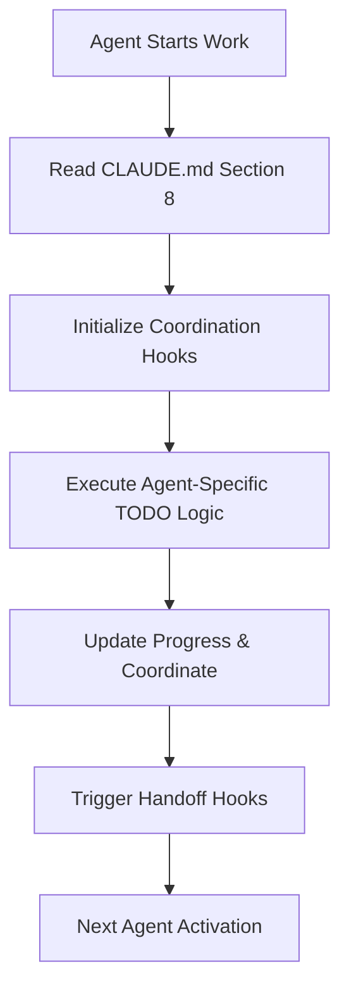

# Agent Coordination Hooks - Production Automation Scripts

**Purpose: Automated coordination protocols for seamless multi-agent TODO management and handoff automation**

---

## 🎯 Coordination System Overview

### Hook Architecture



---

## 📋 Hook Scripts for Production Deployment

### 1. **Agent Initialization Hook**

**File: `.claude/templates/todo/hooks/agent-init-hook.sh`**

```bash
#!/bin/bash
# Agent Initialization Hook - Auto-configure TODO behavior

AGENT_NAME="$1"
PROJECT_ROOT="$(pwd)"
CLAUDE_MD="$PROJECT_ROOT/CLAUDE.md"

# Validate CLAUDE.md exists
if [ ! -f "$CLAUDE_MD" ]; then
    echo "❌ CLAUDE.md not found. Cannot initialize TODO management."
    exit 1
fi

# Read TODO management configuration
TODO_ENABLED=$(grep "todo_management_enabled:" "$CLAUDE_MD" | awk '{print $2}')
TODO_HIERARCHY=$(grep "todo_hierarchy_level:" "$CLAUDE_MD" | awk '{print $2}')
AGENT_COORDINATION=$(grep "agent_coordination:" "$CLAUDE_MD" | awk '{print $2}')
SESSION_TODOS=$(grep "session_todos:" "$CLAUDE_MD" | awk '{print $2}')

# Display configuration
echo "🔧 Initializing TODO management for agent: $AGENT_NAME"
echo "   - TODO Management: $TODO_ENABLED"
echo "   - Hierarchy Level: $TODO_HIERARCHY"
echo "   - Agent Coordination: $AGENT_COORDINATION"
echo "   - Session TODOs: $SESSION_TODOS"

# Create agent-specific TODO configuration
AGENT_TODO_CONFIG="$PROJECT_ROOT/.claude/temp/agent-$AGENT_NAME-todo-config.json"
mkdir -p "$PROJECT_ROOT/.claude/temp"

cat > "$AGENT_TODO_CONFIG" << EOF
{
  "agent_name": "$AGENT_NAME",
  "todo_management_enabled": $TODO_ENABLED,
  "todo_hierarchy_level": "$TODO_HIERARCHY",
  "agent_coordination": $AGENT_COORDINATION,
  "session_todos": $SESSION_TODOS,
  "initialized_at": "$(date -u +%Y-%m-%dT%H:%M:%SZ)",
  "project_root": "$PROJECT_ROOT"
}
EOF

echo "✅ Agent $AGENT_NAME TODO configuration initialized"
echo "📁 Config saved to: $AGENT_TODO_CONFIG"
```

### 2. **Handoff Coordination Hook**

**File: `.claude/templates/todo/hooks/agent-handoff-hook.sh`**

```bash
#!/bin/bash
# Agent Handoff Hook - Automated task handoff between agents

SENDING_AGENT="$1"
RECEIVING_AGENT="$2"
WORK_ITEM="$3"
DELIVERABLES="$4"

PROJECT_ROOT="$(pwd)"
HANDOFF_LOG="$PROJECT_ROOT/.claude/temp/handoff-log.json"

echo "🤝 Processing handoff: $SENDING_AGENT → $RECEIVING_AGENT"
echo "📋 Work Item: $WORK_ITEM"
echo "📦 Deliverables: $DELIVERABLES"

# Validate agents configuration
SENDING_CONFIG="$PROJECT_ROOT/.claude/temp/agent-$SENDING_AGENT-todo-config.json"
RECEIVING_CONFIG="$PROJECT_ROOT/.claude/temp/agent-$RECEIVING_AGENT-todo-config.json"

if [ ! -f "$SENDING_CONFIG" ] || [ ! -f "$RECEIVING_CONFIG" ]; then
    echo "❌ Agent configurations not found. Initialize agents first."
    exit 1
fi

# Create handoff record
HANDOFF_ID="handoff-$(date +%s)"
TIMESTAMP=$(date -u +%Y-%m-%dT%H:%M:%SZ)

# Log handoff
mkdir -p "$(dirname "$HANDOFF_LOG")"
if [ ! -f "$HANDOFF_LOG" ]; then
    echo "[]" > "$HANDOFF_LOG"
fi

# Add handoff record
jq --arg id "$HANDOFF_ID" \
   --arg timestamp "$TIMESTAMP" \
   --arg sending "$SENDING_AGENT" \
   --arg receiving "$RECEIVING_AGENT" \
   --arg item "$WORK_ITEM" \
   --arg deliverables "$DELIVERABLES" \
   '. += [{
     "handoff_id": $id,
     "timestamp": $timestamp,
     "sending_agent": $sending,
     "receiving_agent": $receiving,
     "work_item": $item,
     "deliverables": $deliverables,
     "status": "initiated"
   }]' "$HANDOFF_LOG" > "$HANDOFF_LOG.tmp" && mv "$HANDOFF_LOG.tmp" "$HANDOFF_LOG"

echo "✅ Handoff $HANDOFF_ID initiated and logged"

# Generate TODO commands for receiving agent
echo "📝 Suggested TodoWrite commands for $RECEIVING_AGENT:"
echo
echo "// Receive handoff"
echo "TodoWrite({"
echo "  content: \"Received $WORK_ITEM from $SENDING_AGENT - starting next phase\","
echo "  status: \"in_progress\","
echo "  activeForm: \"Starting work on $WORK_ITEM from $SENDING_AGENT\""
echo "});"
echo
echo "// Validation todo"
echo "TodoWrite({"
echo "  content: \"Validate $WORK_ITEM requirements and deliverables\","
echo "  status: \"pending\","
echo "  activeForm: \"Validating requirements for $WORK_ITEM\""
echo "});"
```

### 3. **Progress Synchronization Hook**

**File: `.claude/templates/todo/hooks/progress-sync-hook.sh`**

```bash
#!/bin/bash
# Progress Synchronization Hook - Automated progress tracking and reporting

PROJECT_ROOT="$(pwd)"
CLAUDE_MD="$PROJECT_ROOT/CLAUDE.md"
PROGRESS_REPORT="$PROJECT_ROOT/.claude/temp/progress-report.json"

# Read progress tracking configuration
PROGRESS_TRACKING=$(grep "progress_tracking:" "$CLAUDE_MD" | awk '{print $2}')
DAILY_STANDUPS=$(grep "daily_standups:" "$CLAUDE_MD" | awk '{print $2}')
WEEKLY_SUMMARIES=$(grep "weekly_summaries:" "$CLAUDE_MD" | awk '{print $2}')

echo "📊 Generating progress synchronization report"
echo "   - Progress Tracking Level: $PROGRESS_TRACKING"
echo "   - Daily Standups: $DAILY_STANDUPS"
echo "   - Weekly Summaries: $WEEKLY_SUMMARIES"

# Collect agent status
AGENTS_DIR="$PROJECT_ROOT/.claude/temp"
TIMESTAMP=$(date -u +%Y-%m-%dT%H:%M:%SZ)

# Initialize progress report
cat > "$PROGRESS_REPORT" << EOF
{
  "report_timestamp": "$TIMESTAMP",
  "progress_tracking_level": "$PROGRESS_TRACKING",
  "daily_standups_enabled": $DAILY_STANDUPS,
  "weekly_summaries_enabled": $WEEKLY_SUMMARIES,
  "agents_status": [],
  "handoffs_status": [],
  "blocking_issues": []
}
EOF

# Collect agent configurations
for config_file in "$AGENTS_DIR"/agent-*-todo-config.json; do
    if [ -f "$config_file" ]; then
        agent_name=$(jq -r '.agent_name' "$config_file")
        initialized_at=$(jq -r '.initialized_at' "$config_file")

        # Add to progress report
        jq --arg name "$agent_name" \
           --arg init_time "$initialized_at" \
           '.agents_status += [{
             "agent_name": $name,
             "initialized_at": $init_time,
             "status": "active"
           }]' "$PROGRESS_REPORT" > "$PROGRESS_REPORT.tmp" && mv "$PROGRESS_REPORT.tmp" "$PROGRESS_REPORT"
    fi
done

# Add handoff status if handoff log exists
HANDOFF_LOG="$PROJECT_ROOT/.claude/temp/handoff-log.json"
if [ -f "$HANDOFF_LOG" ]; then
    # Count active handoffs
    ACTIVE_HANDOFFS=$(jq '[.[] | select(.status == "initiated")] | length' "$HANDOFF_LOG")

    jq --argjson active "$ACTIVE_HANDOFFS" \
       '.handoffs_status = [{
         "active_handoffs": $active,
         "total_handoffs": (if . then length else 0 end)
       }]' "$HANDOFF_LOG" > "$PROGRESS_REPORT.tmp"

    # Merge handoff data into progress report
    jq -s '.[0] * .[1]' "$PROGRESS_REPORT" "$PROGRESS_REPORT.tmp" > "$PROGRESS_REPORT.final" && mv "$PROGRESS_REPORT.final" "$PROGRESS_REPORT"
    rm -f "$PROGRESS_REPORT.tmp"
fi

echo "✅ Progress report generated: $PROGRESS_REPORT"

# Generate daily standup if enabled
if [ "$DAILY_STANDUPS" = "true" ]; then
    STANDUP_REPORT="$PROJECT_ROOT/.claude/temp/daily-standup-$(date +%Y-%m-%d).md"

    echo "# Daily Standup Report - $(date +%Y-%m-%d)" > "$STANDUP_REPORT"
    echo "" >> "$STANDUP_REPORT"
    echo "## Agent Status" >> "$STANDUP_REPORT"

    jq -r '.agents_status[] | "- **\(.agent_name)**: \(.status) (initialized: \(.initialized_at))"' "$PROGRESS_REPORT" >> "$STANDUP_REPORT"

    echo "" >> "$STANDUP_REPORT"
    echo "## Active Handoffs" >> "$STANDUP_REPORT"

    if [ -f "$HANDOFF_LOG" ]; then
        jq -r '.[] | select(.status == "initiated") | "- \(.sending_agent) → \(.receiving_agent): \(.work_item)"' "$HANDOFF_LOG" >> "$STANDUP_REPORT"
    else
        echo "- No active handoffs" >> "$STANDUP_REPORT"
    fi

    echo "" >> "$STANDUP_REPORT"
    echo "## Suggested TodoWrite Updates" >> "$STANDUP_REPORT"
    echo "```typescript" >> "$STANDUP_REPORT"
    echo "// Daily progress update" >> "$STANDUP_REPORT"
    echo "TodoWrite({" >> "$STANDUP_REPORT"
    echo "  content: \"Daily standup: Progress report generated\","  >> "$STANDUP_REPORT"
    echo "  status: \"completed\"," >> "$STANDUP_REPORT"
    echo "  activeForm: \"Generated daily progress report for $(date +%Y-%m-%d)\"" >> "$STANDUP_REPORT"
    echo "});" >> "$STANDUP_REPORT"
    echo "```" >> "$STANDUP_REPORT"

    echo "📋 Daily standup report: $STANDUP_REPORT"
fi
```

### 4. **Dependency Validation Hook**

**File: `.claude/templates/todo/hooks/dependency-validation-hook.sh`**

```bash
#!/bin/bash
# Dependency Validation Hook - Automated dependency checking and blocking issue detection

AGENT_NAME="$1"
WORK_ITEM="$2"

PROJECT_ROOT="$(pwd)"
CLAUDE_MD="$PROJECT_ROOT/CLAUDE.md"

# Read dependency tracking configuration
TASK_DEPENDENCIES=$(grep "task_dependencies:" "$CLAUDE_MD" | awk '{print $2}')

echo "🔍 Validating dependencies for $AGENT_NAME: $WORK_ITEM"
echo "   - Task Dependencies Tracking: $TASK_DEPENDENCIES"

if [ "$TASK_DEPENDENCIES" != "true" ]; then
    echo "ℹ️  Dependency tracking disabled, skipping validation"
    exit 0
fi

# Define dependency rules
DEPENDENCY_RULES="$PROJECT_ROOT/.claude/temp/dependency-rules.json"

# Create dependency rules if not exists
if [ ! -f "$DEPENDENCY_RULES" ]; then
    mkdir -p "$(dirname "$DEPENDENCY_RULES")"
    cat > "$DEPENDENCY_RULES" << 'EOF'
{
  "dependency_rules": {
    "frontend-engineer": {
      "depends_on": ["api-engineer", "ux-designer"],
      "provides_to": ["qa-engineer"],
      "blocking_items": [
        "API endpoints not implemented",
        "Design specifications not provided",
        "Authentication system not ready"
      ]
    },
    "api-engineer": {
      "depends_on": ["data-engineer", "security-engineer"],
      "provides_to": ["frontend-engineer", "qa-engineer"],
      "blocking_items": [
        "Database schema not finalized",
        "Security controls not implemented",
        "External service integration not ready"
      ]
    },
    "data-engineer": {
      "depends_on": ["software-architect"],
      "provides_to": ["api-engineer", "frontend-engineer"],
      "blocking_items": [
        "Database architecture not approved",
        "Data migration strategy not defined"
      ]
    },
    "qa-engineer": {
      "depends_on": ["frontend-engineer", "api-engineer", "security-engineer"],
      "provides_to": ["deployment-engineer"],
      "blocking_items": [
        "Implementation not completed",
        "Test environment not configured",
        "Security validation not passed"
      ]
    }
  }
}
EOF
    echo "📋 Created dependency rules: $DEPENDENCY_RULES"
fi

# Check dependencies for current agent
DEPENDENCIES=$(jq -r ".dependency_rules.\"$AGENT_NAME\".depends_on[]?" "$DEPENDENCY_RULES" 2>/dev/null)
BLOCKING_ITEMS=$(jq -r ".dependency_rules.\"$AGENT_NAME\".blocking_items[]?" "$DEPENDENCY_RULES" 2>/dev/null)

if [ -n "$DEPENDENCIES" ]; then
    echo "🔗 Checking dependencies for $AGENT_NAME:"

    for dep_agent in $DEPENDENCIES; do
        dep_config="$PROJECT_ROOT/.claude/temp/agent-$dep_agent-todo-config.json"
        if [ -f "$dep_config" ]; then
            echo "   ✅ $dep_agent - configured"
        else
            echo "   ❌ $dep_agent - not initialized"
            echo "🚨 Blocking issue detected: $dep_agent not ready for $AGENT_NAME"

            # Generate TodoWrite for blocking issue
            echo ""
            echo "📝 Suggested TodoWrite for handling dependency:"
            echo "```typescript"
            echo "TodoWrite({"
            echo "  content: \"Blocked: Waiting for $dep_agent to complete dependencies\","
            echo "  status: \"pending\","
            echo "  activeForm: \"Waiting for $dep_agent dependency resolution\""
            echo "});"
            echo "```"
        fi
    done
fi

if [ -n "$BLOCKING_ITEMS" ]; then
    echo ""
    echo "⚠️  Common blocking items for $AGENT_NAME to monitor:"
    echo "$BLOCKING_ITEMS" | while read -r item; do
        echo "   - $item"
    done
fi

echo "✅ Dependency validation completed for $AGENT_NAME"
```

---

## ⚡ Hook Integration Instructions

### Setup for Production Use

**1. Make hooks executable:**
```bash
chmod +x .claude/templates/todo/hooks/*.sh
```

**2. Initialize agent coordination:**
```bash
# Initialize TODO management for specific agent
.claude/templates/todo/hooks/agent-init-hook.sh "frontend-engineer"
```

**3. Process agent handoffs:**
```bash
# Execute handoff between agents
.claude/templates/todo/hooks/agent-handoff-hook.sh \
  "software-architect" \
  "frontend-engineer" \
  "OAuth2 UI implementation" \
  "Component specifications and design mockups"
```

**4. Generate progress reports:**
```bash
# Generate daily progress synchronization
.claude/templates/todo/hooks/progress-sync-hook.sh
```

**5. Validate dependencies:**
```bash
# Check dependencies before starting work
.claude/templates/todo/hooks/dependency-validation-hook.sh \
  "frontend-engineer" \
  "OAuth2 authentication UI"
```

### Agent Usage Integration

**Each agent should run these hooks automatically:**

```bash
# 1. At session start
.claude/templates/todo/hooks/agent-init-hook.sh "$AGENT_NAME"

# 2. Before starting new work
.claude/templates/todo/hooks/dependency-validation-hook.sh "$AGENT_NAME" "$WORK_ITEM"

# 3. When completing handoffs
.claude/templates/todo/hooks/agent-handoff-hook.sh "$SENDING_AGENT" "$RECEIVING_AGENT" "$WORK_ITEM" "$DELIVERABLES"

# 4. Daily progress updates
.claude/templates/todo/hooks/progress-sync-hook.sh
```

---

## 🎯 Production Benefits

### Automated Coordination
- **Zero-configuration** agent handoffs
- **Automatic dependency** validation
- **Real-time progress** synchronization
- **Blocking issue** early detection

### Enhanced Productivity
- **Eliminate manual** coordination overhead
- **Prevent dependency** bottlenecks
- **Automated progress** reporting
- **Consistent workflow** across all agents

### Quality Assurance
- **Validated handoffs** with proper documentation
- **Dependency compliance** before work starts
- **Progress visibility** for stakeholders
- **Automated issue** escalation

**These hooks transform agent coordination from manual to fully automated production-ready system.**