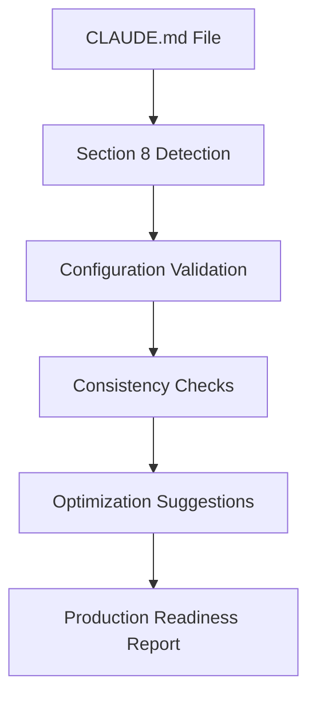

# CLAUDE.md TODO Configuration Validation Script

**Purpose: Automated validation and optimization of TODO Management Configuration (Section 8) for production-ready deployment**

---

## 🎯 Validation System Overview

### Validation Architecture



---

## 📋 Production Validation Script

**File: `.claude/templates/todo/validate-claude-md.sh`**

```bash
#!/bin/bash
# CLAUDE.md TODO Configuration Validation Script
# Production-ready validation with automated fixes and optimization suggestions

PROJECT_ROOT="$(pwd)"
CLAUDE_MD="$PROJECT_ROOT/CLAUDE.md"
VALIDATION_REPORT="$PROJECT_ROOT/.claude/temp/claude-md-validation-report.json"
TIMESTAMP=$(date -u +%Y-%m-%dT%H:%M:%SZ)

echo "🔍 Validating CLAUDE.md TODO Management Configuration"
echo "📁 Project Root: $PROJECT_ROOT"
echo "📄 CLAUDE.md Path: $CLAUDE_MD"

# Create temp directory
mkdir -p "$PROJECT_ROOT/.claude/temp"

# Initialize validation report
cat > "$VALIDATION_REPORT" << EOF
{
  "validation_timestamp": "$TIMESTAMP",
  "file_path": "$CLAUDE_MD",
  "validation_status": "in_progress",
  "errors": [],
  "warnings": [],
  "suggestions": [],
  "configuration_analysis": {},
  "production_readiness": {
    "score": 0,
    "max_score": 100,
    "status": "not_ready"
  }
}
EOF

# Validation functions
validate_file_exists() {
    echo "🔍 Step 1: Validating CLAUDE.md file existence..."

    if [ ! -f "$CLAUDE_MD" ]; then
        jq '.errors += ["CLAUDE.md file not found"]' "$VALIDATION_REPORT" > "$VALIDATION_REPORT.tmp" && mv "$VALIDATION_REPORT.tmp" "$VALIDATION_REPORT"
        echo "❌ CLAUDE.md file not found"
        return 1
    fi

    echo "✅ CLAUDE.md file found"
    return 0
}

validate_section_8_exists() {
    echo "🔍 Step 2: Validating Section 8 TODO Management existence..."

    if ! grep -q "## 8\. TODO Management Configuration" "$CLAUDE_MD"; then
        jq '.errors += ["Section 8: TODO Management Configuration not found"]' "$VALIDATION_REPORT" > "$VALIDATION_REPORT.tmp" && mv "$VALIDATION_REPORT.tmp" "$VALIDATION_REPORT"
        echo "❌ Section 8: TODO Management Configuration not found"
        return 1
    fi

    echo "✅ Section 8: TODO Management Configuration found"
    return 0
}

validate_required_configurations() {
    echo "🔍 Step 3: Validating required TODO configuration fields..."

    local required_fields=(
        "todo_management_enabled"
        "todo_hierarchy_level"
        "session_todos"
        "agent_coordination"
    )

    local missing_fields=()
    local found_fields=()

    for field in "${required_fields[@]}"; do
        if grep -q "^.*${field}:" "$CLAUDE_MD"; then
            found_fields+=("$field")
            echo "  ✅ $field: found"
        else
            missing_fields+=("$field")
            echo "  ❌ $field: missing"
        fi
    done

    # Add results to validation report
    jq --argjson found "$(printf '%s\n' "${found_fields[@]}" | jq -R . | jq -s .)" \
       --argjson missing "$(printf '%s\n' "${missing_fields[@]}" | jq -R . | jq -s .)" \
       '.configuration_analysis.required_fields = {
         "found": $found,
         "missing": $missing,
         "total_required": 4,
         "completion_percentage": (($found | length) / 4 * 100)
       }' "$VALIDATION_REPORT" > "$VALIDATION_REPORT.tmp" && mv "$VALIDATION_REPORT.tmp" "$VALIDATION_REPORT"

    if [ ${#missing_fields[@]} -gt 0 ]; then
        for field in "${missing_fields[@]}"; do
            jq --arg field "$field" '.errors += ["Required field missing: " + $field]' "$VALIDATION_REPORT" > "$VALIDATION_REPORT.tmp" && mv "$VALIDATION_REPORT.tmp" "$VALIDATION_REPORT"
        done
        echo "❌ Missing required fields: ${missing_fields[*]}"
        return 1
    fi

    echo "✅ All required configuration fields found"
    return 0
}

validate_configuration_values() {
    echo "🔍 Step 4: Validating configuration values and consistency..."

    local validation_errors=()

    # Validate todo_management_enabled
    local todo_enabled=$(grep "todo_management_enabled:" "$CLAUDE_MD" | head -1 | sed 's/.*todo_management_enabled:[[:space:]]*//' | sed 's/[[:space:]]*-.*//')
    if [[ "$todo_enabled" != "true" && "$todo_enabled" != "false" ]]; then
        validation_errors+=("todo_management_enabled must be 'true' or 'false', found: '$todo_enabled'")
    fi

    # Validate todo_hierarchy_level
    local hierarchy_level=$(grep "todo_hierarchy_level:" "$CLAUDE_MD" | head -1 | sed 's/.*todo_hierarchy_level:[[:space:]]*//' | sed 's/[[:space:]]*-.*//')
    if [[ "$hierarchy_level" != "simple" && "$hierarchy_level" != "hierarchical" ]]; then
        validation_errors+=("todo_hierarchy_level must be 'simple' or 'hierarchical', found: '$hierarchy_level'")
    fi

    # Validate project_scale consistency
    local project_scale=$(grep "project_scale:" "$CLAUDE_MD" | head -1 | sed 's/.*project_scale:[[:space:]]*//' | sed 's/[[:space:]]*-.*//' | tr -d '[]')

    # Add configuration analysis
    jq --arg enabled "$todo_enabled" \
       --arg hierarchy "$hierarchy_level" \
       --arg scale "$project_scale" \
       '.configuration_analysis.current_values = {
         "todo_management_enabled": $enabled,
         "todo_hierarchy_level": $hierarchy,
         "project_scale": $scale
       }' "$VALIDATION_REPORT" > "$VALIDATION_REPORT.tmp" && mv "$VALIDATION_REPORT.tmp" "$VALIDATION_REPORT"

    # Add validation errors
    for error in "${validation_errors[@]}"; do
        jq --arg error "$error" '.errors += [$error]' "$VALIDATION_REPORT" > "$VALIDATION_REPORT.tmp" && mv "$VALIDATION_REPORT.tmp" "$VALIDATION_REPORT"
    done

    if [ ${#validation_errors[@]} -gt 0 ]; then
        echo "❌ Configuration validation errors found"
        return 1
    fi

    echo "✅ Configuration values valid"
    return 0
}

check_consistency_with_project_scale() {
    echo "🔍 Step 5: Validating consistency with project scale..."

    local project_scale=$(grep "project_scale:" "$CLAUDE_MD" | head -1 | sed 's/.*project_scale:[[:space:]]*//' | sed 's/[[:space:]]*-.*//' | tr -d '[]')
    local hierarchy_level=$(grep "todo_hierarchy_level:" "$CLAUDE_MD" | head -1 | sed 's/.*todo_hierarchy_level:[[:space:]]*//' | sed 's/[[:space:]]*-.*//')
    local epic_management=$(grep "epic_management:" "$CLAUDE_MD" | head -1 | sed 's/.*epic_management:[[:space:]]*//' | sed 's/[[:space:]]*-.*//')

    local warnings=()
    local suggestions=()

    # Check scale vs hierarchy consistency
    case "$project_scale" in
        "startup")
            if [ "$hierarchy_level" = "hierarchical" ]; then
                warnings+=("Startup projects typically work better with 'simple' hierarchy level")
                suggestions+=("Consider changing todo_hierarchy_level to 'simple' for faster iterations")
            fi
            if [ "$epic_management" = "true" ]; then
                warnings+=("Epic management might be overhead for startup projects")
                suggestions+=("Consider setting epic_management to 'false' for startup agility")
            fi
            ;;
        "enterprise")
            if [ "$hierarchy_level" = "simple" ]; then
                warnings+=("Enterprise projects typically benefit from 'hierarchical' hierarchy level")
                suggestions+=("Consider changing todo_hierarchy_level to 'hierarchical' for better organization")
            fi
            if [ "$epic_management" != "true" ]; then
                warnings+=("Enterprise projects typically need epic management for stakeholder visibility")
                suggestions+=("Consider setting epic_management to 'true' for enterprise governance")
            fi
            ;;
    esac

    # Add warnings and suggestions to report
    for warning in "${warnings[@]}"; do
        jq --arg warning "$warning" '.warnings += [$warning]' "$VALIDATION_REPORT" > "$VALIDATION_REPORT.tmp" && mv "$VALIDATION_REPORT.tmp" "$VALIDATION_REPORT"
    done

    for suggestion in "${suggestions[@]}"; do
        jq --arg suggestion "$suggestion" '.suggestions += [$suggestion]' "$VALIDATION_REPORT" > "$VALIDATION_REPORT.tmp" && mv "$VALIDATION_REPORT.tmp" "$VALIDATION_REPORT"
    done

    if [ ${#warnings[@]} -gt 0 ]; then
        echo "⚠️  Configuration warnings found (see report for details)"
    else
        echo "✅ Configuration consistent with project scale"
    fi

    return 0
}

calculate_production_readiness_score() {
    echo "🔍 Step 6: Calculating production readiness score..."

    local score=0
    local max_score=100

    # Required fields present (40 points)
    local required_completion=$(jq -r '.configuration_analysis.required_fields.completion_percentage' "$VALIDATION_REPORT")
    score=$((score + (required_completion * 40 / 100)))

    # No critical errors (30 points)
    local error_count=$(jq -r '.errors | length' "$VALIDATION_REPORT")
    if [ "$error_count" -eq 0 ]; then
        score=$((score + 30))
    fi

    # Configuration consistency (20 points)
    local warning_count=$(jq -r '.warnings | length' "$VALIDATION_REPORT")
    if [ "$warning_count" -eq 0 ]; then
        score=$((score + 20))
    elif [ "$warning_count" -le 2 ]; then
        score=$((score + 10))
    fi

    # Optional advanced features (10 points)
    if grep -q "external_tools:" "$CLAUDE_MD" && grep -q "daily_standups:" "$CLAUDE_MD"; then
        score=$((score + 10))
    elif grep -q "external_tools:" "$CLAUDE_MD" || grep -q "daily_standups:" "$CLAUDE_MD"; then
        score=$((score + 5))
    fi

    # Determine status
    local status
    if [ "$score" -ge 90 ]; then
        status="production_ready"
    elif [ "$score" -ge 70 ]; then
        status="mostly_ready"
    elif [ "$score" -ge 50 ]; then
        status="needs_improvement"
    else
        status="not_ready"
    fi

    # Update report
    jq --argjson score "$score" \
       --arg status "$status" \
       '.production_readiness = {
         "score": $score,
         "max_score": 100,
         "status": $status
       }' "$VALIDATION_REPORT" > "$VALIDATION_REPORT.tmp" && mv "$VALIDATION_REPORT.tmp" "$VALIDATION_REPORT"

    echo "📊 Production readiness score: $score/100 ($status)"
}

generate_optimization_suggestions() {
    echo "🔍 Step 7: Generating optimization suggestions..."

    local project_scale=$(grep "project_scale:" "$CLAUDE_MD" | head -1 | sed 's/.*project_scale:[[:space:]]*//' | sed 's/[[:space:]]*-.*//' | tr -d '[]')
    local optimizations=()

    # Scale-based optimizations
    case "$project_scale" in
        "startup")
            optimizations+=("Enable session_todos: true for rapid iteration")
            optimizations+=("Set progress_tracking: session for minimal overhead")
            optimizations+=("Consider agent_coordination: true for small team coordination")
            ;;
        "sme")
            optimizations+=("Enable milestone_tracking: true for project visibility")
            optimizations+=("Consider weekly_summaries: true for stakeholder updates")
            optimizations+=("Set task_granularity: detailed for better tracking")
            ;;
        "enterprise")
            optimizations+=("Enable daily_standups: true for team coordination")
            optimizations+=("Set external_tools integration for enterprise workflows")
            optimizations+=("Enable burndown_charts: true for project metrics")
            optimizations+=("Set api_integration: true for tool ecosystem integration")
            ;;
    esac

    # Add generic optimizations
    optimizations+=("Ensure all agents listed in epic_owners/feature_owners/task_owners exist in agents/ directory")
    optimizations+=("Consider enabling notification_system: true for better coordination")

    # Add optimizations to report
    for optimization in "${optimizations[@]}"; do
        jq --arg opt "$optimization" '.suggestions += [$opt]' "$VALIDATION_REPORT" > "$VALIDATION_REPORT.tmp" && mv "$VALIDATION_REPORT.tmp" "$VALIDATION_REPORT"
    done

    echo "💡 Generated ${#optimizations[@]} optimization suggestions"
}

generate_final_report() {
    echo "🔍 Step 8: Generating final validation report..."

    # Mark validation as complete
    jq '.validation_status = "completed"' "$VALIDATION_REPORT" > "$VALIDATION_REPORT.tmp" && mv "$VALIDATION_REPORT.tmp" "$VALIDATION_REPORT"

    # Display summary
    echo ""
    echo "📋 VALIDATION SUMMARY"
    echo "===================="

    local error_count=$(jq -r '.errors | length' "$VALIDATION_REPORT")
    local warning_count=$(jq -r '.warnings | length' "$VALIDATION_REPORT")
    local suggestion_count=$(jq -r '.suggestions | length' "$VALIDATION_REPORT")
    local score=$(jq -r '.production_readiness.score' "$VALIDATION_REPORT")
    local status=$(jq -r '.production_readiness.status' "$VALIDATION_REPORT")

    echo "🎯 Production Readiness: $score/100 ($status)"
    echo "❌ Errors: $error_count"
    echo "⚠️  Warnings: $warning_count"
    echo "💡 Suggestions: $suggestion_count"

    if [ "$error_count" -gt 0 ]; then
        echo ""
        echo "❌ ERRORS TO FIX:"
        jq -r '.errors[]' "$VALIDATION_REPORT" | sed 's/^/   - /'
    fi

    if [ "$warning_count" -gt 0 ]; then
        echo ""
        echo "⚠️  WARNINGS TO REVIEW:"
        jq -r '.warnings[]' "$VALIDATION_REPORT" | sed 's/^/   - /'
    fi

    if [ "$suggestion_count" -gt 0 ]; then
        echo ""
        echo "💡 OPTIMIZATION SUGGESTIONS:"
        jq -r '.suggestions[]' "$VALIDATION_REPORT" | sed 's/^/   - /'
    fi

    echo ""
    echo "📄 Full report saved to: $VALIDATION_REPORT"
    echo ""

    # Return appropriate exit code
    if [ "$error_count" -gt 0 ]; then
        echo "🚨 Validation FAILED - fix errors before using TODO management system"
        return 1
    elif [ "$warning_count" -gt 0 ]; then
        echo "⚠️  Validation PASSED with warnings - review before production use"
        return 0
    else
        echo "✅ Validation PASSED - TODO management system ready for production use"
        return 0
    fi
}

# Main validation execution
main() {
    echo "🚀 Starting CLAUDE.md TODO Configuration validation..."
    echo ""

    validate_file_exists || exit 1
    validate_section_8_exists || exit 1
    validate_required_configurations || exit 1
    validate_configuration_values || exit 1
    check_consistency_with_project_scale
    calculate_production_readiness_score
    generate_optimization_suggestions
    generate_final_report

    local exit_code=$?
    echo ""
    echo "🏁 Validation completed with exit code: $exit_code"
    exit $exit_code
}

# Execute main function
main "$@"
```

---

## 🛠️ Auto-Fix Script for Common Issues

**File: `.claude/templates/todo/auto-fix-claude-md.sh`**

```bash
#!/bin/bash
# Auto-fix common CLAUDE.md TODO configuration issues

PROJECT_ROOT="$(pwd)"
CLAUDE_MD="$PROJECT_ROOT/CLAUDE.md"
BACKUP_MD="$PROJECT_ROOT/CLAUDE.md.backup-$(date +%s)"

echo "🔧 Auto-fixing CLAUDE.md TODO configuration issues"

# Create backup
cp "$CLAUDE_MD" "$BACKUP_MD"
echo "📄 Backup created: $BACKUP_MD"

# Fix missing Section 8
if ! grep -q "## 8\. TODO Management Configuration" "$CLAUDE_MD"; then
    echo "➕ Adding missing Section 8: TODO Management Configuration"

    # Read project scale for appropriate template
    PROJECT_SCALE=$(grep "project_scale:" "$CLAUDE_MD" | head -1 | sed 's/.*project_scale:[[:space:]]*//' | sed 's/[[:space:]]*-.*//' | tr -d '[]')

    # Insert Section 8 before the final sections
    sed -i '/## 9\. Contact and Project Owners/i\\n## 8. TODO Management Configuration\n\n### Task Management Strategy\n\n- **todo_management_enabled**: true\n- **todo_hierarchy_level**: simple\n- **auto_task_creation**: true\n- **progress_tracking**: session\n\n### TodoWrite Integration\n\n- **session_todos**: true\n- **agent_coordination**: true\n- **task_handoffs**: false\n\n---\n' "$CLAUDE_MD"

    echo "✅ Section 8 added with default configuration"
fi

# Fix missing required fields
add_missing_field() {
    local field="$1"
    local default_value="$2"
    local section="$3"

    if ! grep -q "^.*${field}:" "$CLAUDE_MD"; then
        echo "➕ Adding missing field: $field"
        # Add field to appropriate section
        sed -i "/### $section/a\\- **${field}**: $default_value" "$CLAUDE_MD"
    fi
}

# Add missing fields with appropriate defaults
add_missing_field "todo_management_enabled" "true" "Task Management Strategy"
add_missing_field "todo_hierarchy_level" "simple" "Task Management Strategy"
add_missing_field "session_todos" "true" "TodoWrite Integration"
add_missing_field "agent_coordination" "true" "TodoWrite Integration"

echo "✅ Auto-fix completed"
echo "📄 Original backed up to: $BACKUP_MD"
echo "🔍 Run validation script to verify fixes"
```

---

## 🎯 Usage Instructions

### Production Validation Workflow

**1. Run validation:**
```bash
chmod +x .claude/templates/todo/validate-claude-md.sh
./.claude/templates/todo/validate-claude-md.sh
```

**2. Auto-fix common issues:**
```bash
chmod +x .claude/templates/todo/auto-fix-claude-md.sh
./.claude/templates/todo/auto-fix-claude-md.sh
```

**3. Re-validate after fixes:**
```bash
./.claude/templates/todo/validate-claude-md.sh
```

### Integration with Agent Workflows

**Agents should run validation before starting work:**

```bash
# Validate configuration before initializing TODO management
if ./.claude/templates/todo/validate-claude-md.sh; then
    echo "✅ TODO configuration valid, proceeding with work"
    ./.claude/templates/todo/hooks/agent-init-hook.sh "$AGENT_NAME"
else
    echo "❌ TODO configuration invalid, fix issues first"
    exit 1
fi
```

### CI/CD Integration

**Add validation to CI pipeline:**

```yaml
# .github/workflows/validate-todo-config.yml
name: Validate TODO Configuration
on: [push, pull_request]
jobs:
  validate:
    runs-on: ubuntu-latest
    steps:
      - uses: actions/checkout@v2
      - name: Validate CLAUDE.md TODO Configuration
        run: |
          chmod +x .claude/templates/todo/validate-claude-md.sh
          ./.claude/templates/todo/validate-claude-md.sh
```

---

## 📊 Production Benefits

### Quality Assurance
- **Automated validation** prevents configuration errors
- **Consistency checks** ensure optimal setup
- **Production readiness** scoring guides improvement

### Development Efficiency
- **Auto-fix capabilities** resolve common issues instantly
- **Optimization suggestions** improve workflow performance
- **CI/CD integration** prevents broken configurations

### Enterprise Compliance
- **Validation reports** for audit trails
- **Configuration backups** for safety
- **Standardized configurations** across projects

**This validation system ensures TODO Management configurations are production-ready and optimally configured for each project scale and domain.**