# Claude Code Multi-Agent Framework - Agent Ecosystem Map

## Complete Agent Ecosystem (45 Agents)

```mermaid
graph TB
    subgraph "CLAUDE CODE MULTI-AGENT ECOSYSTEM"

        subgraph "CORE AGENTS (12) - Strategic Foundation"
            subgraph "Strategy (2)"
                PM[product-manager<br/>🎯 Product Strategy<br/>Business Requirements]
                BA[business-analyst<br/>📊 Requirements Analysis<br/>Stakeholder Management]
            end

            subgraph "Architecture (2)"
                SA[software-architect<br/>🏗️ System Design<br/>Technical Architecture]
                UX[ux-designer<br/>🎨 User Experience<br/>Design Systems]
            end

            subgraph "Development (3)"
                FE[frontend-engineer<br/>💻 Frontend Development<br/>UI Implementation]
                BE[backend-engineer<br/>⚙️ Backend Systems<br/>API Development]
                API[api-engineer<br/>🔌 API Design<br/>Integration Patterns]
            end

            subgraph "Data & Quality (3)"
                DE[data-engineer<br/>📈 Data Pipelines<br/>Analytics Infrastructure]
                QA[qa-engineer<br/>🧪 Quality Assurance<br/>Testing Automation]
                SEC[security-engineer<br/>🔒 Security Architecture<br/>Threat Modeling]
            end

            subgraph "Operations (2)"
                SM[session-manager<br/>💾 Session Management<br/>Context Preservation]
                DEPLOY[deployment-engineer<br/>🚀 Deployment Automation<br/>Infrastructure Management]
            end
        end

        subgraph "ENTERPRISE AGENTS (24) - Fortune 500 Ready"
            subgraph "Governance & Compliance (4)"
                COMP[compliance-auditor<br/>📋 SOX, HIPAA, GDPR<br/>Regulatory Compliance]
                EA[enterprise-architect<br/>🏢 Enterprise Strategy<br/>Digital Transformation]
                GA[governance-architect<br/>⚖️ Data Governance<br/>Enterprise Standards]
                RM[risk-manager<br/>⚠️ Risk Assessment<br/>Business Continuity]
            end

            subgraph "Advanced Operations (6)"
                SRE[sre-engineer<br/>🎖️ Site Reliability<br/>SLA Management]
                MON[monitoring-engineer<br/>📊 Observability<br/>Performance Monitoring]
                PERF[performance-engineer<br/>⚡ Performance Optimization<br/>Scalability Testing]
                REL[reliability-engineer<br/>🛡️ System Reliability<br/>Chaos Engineering]
                INC[incident-responder<br/>🚨 Crisis Management<br/>Incident Response]
                CAP[capacity-planner<br/>📈 Capacity Planning<br/>Load Testing]
            end

            subgraph "Infrastructure (4)"
                CLOUD[cloud-engineer<br/>☁️ Cloud Architecture<br/>Multi-cloud Strategy]
                DEVOPS[devops-architect<br/>🔄 CI/CD Architecture<br/>Infrastructure Automation]
                DBA[database-administrator<br/>🗄️ Database Management<br/>Performance Optimization]
                AUTO[automation-engineer<br/>🤖 Process Automation<br/>Workflow Optimization]
            end

            subgraph "Integration (4)"
                IA[integration-architect<br/>🔗 Enterprise Integration<br/>Service Mesh]
                MW[middleware-engineer<br/>⚙️ Message Brokers<br/>Workflow Orchestration]
                NET[network-architect<br/>🌐 Network Design<br/>Infrastructure Planning]
                PLAT[platform-engineer<br/>🛠️ Developer Platforms<br/>Developer Experience]
            end

            subgraph "Analytics (2)"
                DS[data-scientist<br/>🔬 Machine Learning<br/>Predictive Analytics]
                TW[technical-writer<br/>📝 Technical Documentation<br/>Knowledge Management]
            end

            subgraph "Management (3)"
                PC[project-coordinator<br/>📅 Project Management<br/>Team Coordination]
                PO[project-owner<br/>👑 Project Leadership<br/>Health Monitoring]
                REV[reviewer<br/>🔍 Quality Review<br/>Stakeholder Validation]
            end

            subgraph "Specialized (1)"
                MOB[mobile-developer<br/>📱 Mobile Applications<br/>Cross-platform Development]
            end
        end

        subgraph "CUSTOM AGENTS (9) - Technology Specializations"
            subgraph "Graphics & Visualization (3)"
                G3D[graphics-3d-engineer<br/>🎮 3D Graphics<br/>OpenGL, Vulkan]
                G2D[graphics-2d-engineer<br/>🎨 2D Graphics<br/>Canvas, wxWidgets]
                MATH[math-specialist<br/>📐 Mathematical Algorithms<br/>Computational Geometry]
            end

            subgraph "Hardware & Embedded (2)"
                EMB[embedded-engineer<br/>🔧 Embedded Systems<br/>Arduino, ESP32, IoT]
                ELEC[electronics-engineer<br/>⚡ Electronics Design<br/>PCB, Circuits]
            end

            subgraph "Desktop & Applications (3)"
                DESK[desktop-specialist<br/>🖥️ Desktop Applications<br/>wxWidgets, Qt]
                CAD[cad-engineer<br/>📐 CAD Integration<br/>FreeCAD, Engineering]
                BLENDER[3d-addon-developer<br/>🎯 3D Content Creation<br/>Blender Plugins]
            end

            subgraph "Scientific Computing (1)"
                SCI[scientific-computing-specialist<br/>🔬 Scientific Computing<br/>NumPy, SciPy]
            end
        end
    end

    %% Strategy Layer Connections
    PM --> BA
    BA --> SA
    SA --> UX

    %% Development Flow
    UX --> FE
    SA --> BE
    BE --> API
    API --> DE

    %% Quality & Security
    FE --> QA
    BE --> QA
    API --> SEC
    DE --> SEC

    %% Operations Flow
    QA --> DEPLOY
    SEC --> DEPLOY
    DEPLOY --> SM

    %% Enterprise Governance
    EA --> GA
    GA --> RM
    RM --> COMP

    %% Operations Excellence
    SRE --> MON
    MON --> PERF
    PERF --> REL
    REL --> INC
    INC --> CAP

    %% Infrastructure Coordination
    CLOUD --> DEVOPS
    DEVOPS --> DBA
    DBA --> AUTO

    %% Integration Patterns
    IA --> MW
    MW --> NET
    NET --> PLAT

    %% Analytics & Documentation
    DE --> DS
    DS --> TW

    %% Project Management
    PM --> PC
    PC --> PO
    PO --> REV

    %% Custom Technology Integration
    G3D --> G2D
    G2D --> MATH
    EMB --> ELEC
    DESK --> CAD
    CAD --> BLENDER
    MATH --> SCI

    %% Cross-Category Integrations
    SA --> IA
    BE --> MW
    DEPLOY --> CLOUD
    QA --> PERF
    SEC --> REL
    DE --> SCI
    FE --> DESK
    API --> G3D

    classDef strategy fill:#e3f2fd
    classDef architecture fill:#f3e5f5
    classDef development fill:#e8f5e8
    classDef quality fill:#fff3e0
    classDef operations fill:#fce4ec
    classDef governance fill:#f1f8e9
    classDef advancedOps fill:#e0f2f1
    classDef infrastructure fill:#e8eaf6
    classDef integration fill:#fff8e1
    classDef analytics fill:#f9fbe7
    classDef management fill:#fafafa
    classDef custom fill:#ffebee

    class PM,BA strategy
    class SA,UX architecture
    class FE,BE,API development
    class DE,QA,SEC quality
    class SM,DEPLOY operations
    class COMP,EA,GA,RM governance
    class SRE,MON,PERF,REL,INC,CAP advancedOps
    class CLOUD,DEVOPS,DBA,AUTO infrastructure
    class IA,MW,NET,PLAT integration
    class DS,TW analytics
    class PC,PO,REV,MOB management
    class G3D,G2D,MATH,EMB,ELEC,DESK,CAD,BLENDER,SCI custom
```

## Agent Capability Matrix

### 🎯 Core Strategic Agents
| Agent | Primary Focus | Key Capabilities | Collaboration Partners |
|-------|---------------|------------------|----------------------|
| **product-manager** | Product Strategy | Requirements, Roadmaps, Stakeholder Management | business-analyst, ux-designer |
| **business-analyst** | Requirements Analysis | Process Modeling, Business Cases | product-manager, software-architect |

### 🏗️ Architecture & Design
| Agent | Primary Focus | Key Capabilities | Collaboration Partners |
|-------|---------------|------------------|----------------------|
| **software-architect** | System Architecture | Technical Design, Scalability | ux-designer, backend-engineer |
| **ux-designer** | User Experience | Design Systems, Usability | frontend-engineer, product-manager |

### 💻 Development Excellence
| Agent | Primary Focus | Key Capabilities | Collaboration Partners |
|-------|---------------|------------------|----------------------|
| **frontend-engineer** | Frontend Development | UI Implementation, Performance | ux-designer, backend-engineer |
| **backend-engineer** | Backend Systems | APIs, Databases, Services | frontend-engineer, api-engineer |
| **api-engineer** | API Design | REST, GraphQL, Integration | backend-engineer, data-engineer |

### 📊 Data & Analytics
| Agent | Primary Focus | Key Capabilities | Collaboration Partners |
|-------|---------------|------------------|----------------------|
| **data-engineer** | Data Infrastructure | Pipelines, Analytics, ETL | api-engineer, data-scientist |
| **data-scientist** | Machine Learning | Predictive Models, Analytics | data-engineer, technical-writer |

### 🛡️ Quality & Security
| Agent | Primary Focus | Key Capabilities | Collaboration Partners |
|-------|---------------|------------------|----------------------|
| **qa-engineer** | Quality Assurance | Testing, Automation, Quality Gates | security-engineer, performance-engineer |
| **security-engineer** | Security Architecture | Threat Modeling, Compliance | qa-engineer, compliance-auditor |

### 🚀 Operations & Deployment
| Agent | Primary Focus | Key Capabilities | Collaboration Partners |
|-------|---------------|------------------|----------------------|
| **deployment-engineer** | Deployment Automation | CI/CD, Infrastructure | devops-architect, cloud-engineer |
| **session-manager** | Session Management | Context Preservation, State Recovery | All agents (coordination) |

### 🏢 Enterprise Governance
| Agent | Primary Focus | Key Capabilities | Collaboration Partners |
|-------|---------------|------------------|----------------------|
| **enterprise-architect** | Enterprise Strategy | Digital Transformation, Technology Roadmaps | governance-architect, software-architect |
| **governance-architect** | Governance Frameworks | Policy Development, Risk Management | compliance-auditor, risk-manager |
| **compliance-auditor** | Regulatory Compliance | SOX, HIPAA, GDPR, Audit Preparation | security-engineer, risk-manager |
| **risk-manager** | Risk Management | Business Continuity, Threat Assessment | governance-architect, incident-responder |

### ⚡ Advanced Operations
| Agent | Primary Focus | Key Capabilities | Collaboration Partners |
|-------|---------------|------------------|----------------------|
| **sre-engineer** | Site Reliability | SLA Management, Error Budgets | monitoring-engineer, reliability-engineer |
| **monitoring-engineer** | Observability | Performance Monitoring, Alerting | performance-engineer, incident-responder |
| **performance-engineer** | Performance Optimization | Load Testing, Scalability | capacity-planner, reliability-engineer |
| **reliability-engineer** | System Reliability | Chaos Engineering, Fault Tolerance | sre-engineer, incident-responder |
| **incident-responder** | Crisis Management | Incident Response, Postmortem Analysis | monitoring-engineer, capacity-planner |
| **capacity-planner** | Capacity Planning | Resource Optimization, Growth Planning | performance-engineer, cloud-engineer |

### 🔧 Custom Technology Specializations
| Agent | Primary Focus | Key Capabilities | Collaboration Partners |
|-------|---------------|------------------|----------------------|
| **graphics-3d-engineer** | 3D Graphics | OpenGL, Vulkan, GPU Programming | math-specialist, desktop-specialist |
| **graphics-2d-engineer** | 2D Graphics | Canvas, wxWidgets, Drawing APIs | graphics-3d-engineer, desktop-specialist |
| **math-specialist** | Mathematical Computing | Algorithms, Computational Geometry | graphics-3d-engineer, scientific-computing-specialist |
| **embedded-engineer** | Embedded Systems | Arduino, ESP32, IoT, Firmware | electronics-engineer, desktop-specialist |
| **electronics-engineer** | Electronics Design | PCB Design, Circuit Analysis | embedded-engineer, cad-engineer |
| **desktop-specialist** | Desktop Applications | wxWidgets, Qt, Native Apps | cad-engineer, graphics-2d-engineer |
| **cad-engineer** | CAD Integration | FreeCAD, Parametric Modeling | 3d-addon-developer, electronics-engineer |
| **3d-addon-developer** | 3D Content Creation | Blender Plugins, 3D Workflows | cad-engineer, graphics-3d-engineer |
| **scientific-computing-specialist** | Scientific Computing | NumPy, SciPy, Research Computing | math-specialist, data-scientist |

## Agent Coordination Patterns

### 🔄 Primary Workflows
1. **Product Development**: product-manager → business-analyst → software-architect → development teams
2. **Quality Assurance**: qa-engineer → security-engineer → performance-engineer → deployment-engineer
3. **Enterprise Operations**: sre-engineer → monitoring-engineer → incident-responder → capacity-planner
4. **Technology Specialization**: Custom agents provide specialized domain expertise

### 🎯 Cross-Agent Collaboration
- **TodoWrite Integration**: All agents coordinate through hierarchical task management
- **CLAUDE.md Adaptation**: Every agent automatically adapts to project specifications
- **Handoff Protocols**: Standardized agent-to-agent coordination mechanisms
- **Quality Gates**: Automated validation checkpoints throughout workflows

### 📈 Scalability Patterns
- **Startup Scale**: Core agents (12) provide complete development coverage
- **SME Scale**: Core + selected enterprise agents for business growth
- **Enterprise Scale**: Full ecosystem (45 agents) for Fortune 500 capabilities
- **Custom Scale**: Technology-specific agents for specialized requirements