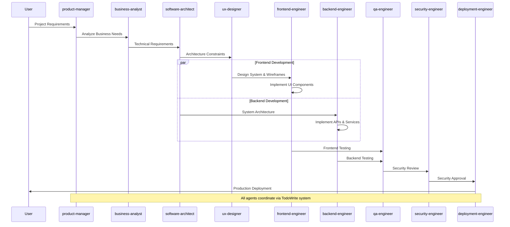
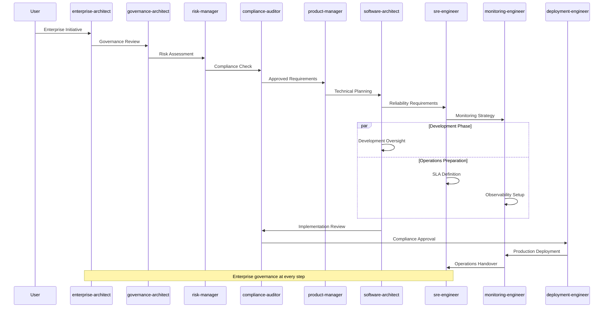
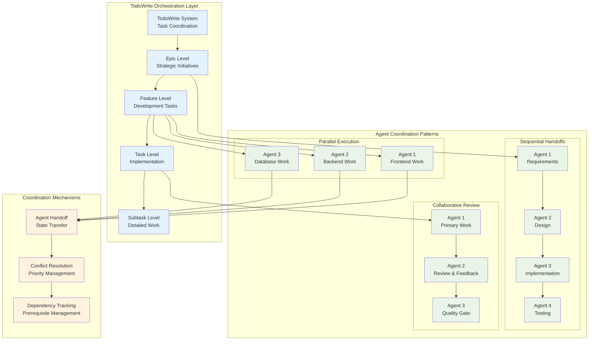
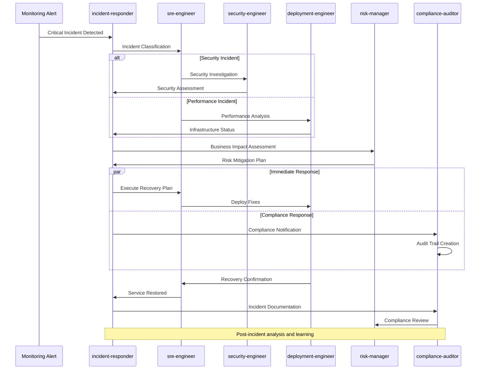
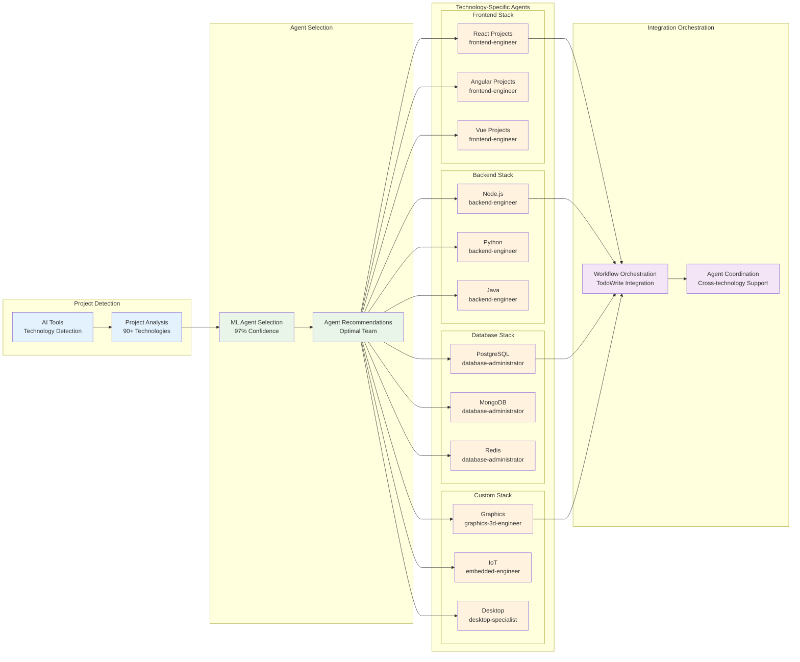
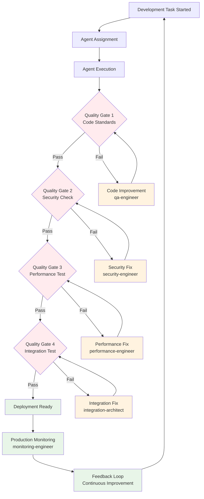

# Claude Code Multi-Agent Framework - Agent Workflow Patterns

## 1. Standard Development Workflow

## 2. Enterprise Project Workflow

## 3. Multi-Agent Coordination Pattern

## 4. Crisis Response Workflow

## 5. Technology Stack Integration Workflow

## 6. Quality Gates and Validation Workflow

## Workflow Coordination Principles

### 🎯 TodoWrite Integration
- **Hierarchical Task Management**: Epic → Feature → Task → Subtask
- **Agent Coordination**: Automatic task assignment and handoffs
- **Progress Tracking**: Real-time visibility into workflow status
- **Dependency Management**: Automatic prerequisite tracking

### ⚡ Parallel vs Sequential Execution
- **Parallel Patterns**: Independent development streams (frontend/backend)
- **Sequential Patterns**: Dependent workflow stages (requirements → design → implementation)
- **Hybrid Patterns**: Mixed parallel and sequential execution
- **Load Balancing**: Optimal agent utilization and resource management

### 🔄 Agent Handoff Protocols
1. **State Transfer**: Complete context and work product handoff
2. **Validation Checkpoints**: Quality gates between agent transitions
3. **Rollback Mechanisms**: Ability to return to previous states
4. **Conflict Resolution**: Automated resolution of agent conflicts

### 📊 Workflow Optimization
- **Performance Metrics**: Workflow execution time and efficiency
- **Bottleneck Detection**: Identification of workflow constraints
- **Resource Optimization**: Agent utilization and capacity planning
- **Continuous Improvement**: Workflow pattern learning and optimization

### 🛡️ Enterprise Workflow Features
- **Governance Integration**: Enterprise approval and oversight workflows
- **Compliance Automation**: Regulatory requirement integration
- **Audit Trails**: Complete workflow documentation and traceability
- **Risk Management**: Risk assessment and mitigation throughout workflows

## Workflow Patterns by Project Scale

### Startup Scale (Core Agents)
- **Simple Linear Workflow**: product-manager → software-architect → development → deployment
- **Minimal Governance**: Essential quality gates only
- **Rapid Iteration**: Fast feedback loops and quick pivots

### SME Scale (Core + Selected Enterprise)
- **Enhanced Governance**: Additional compliance and risk management
- **Specialized Operations**: SRE and monitoring integration
- **Quality Focus**: Enhanced testing and security workflows

### Enterprise Scale (Full Ecosystem)
- **Complete Governance**: Full enterprise architecture and compliance
- **Advanced Operations**: Complete SRE, monitoring, and incident response
- **Custom Specializations**: Technology-specific expert agents
- **Global Coordination**: Multi-team and multi-project coordination