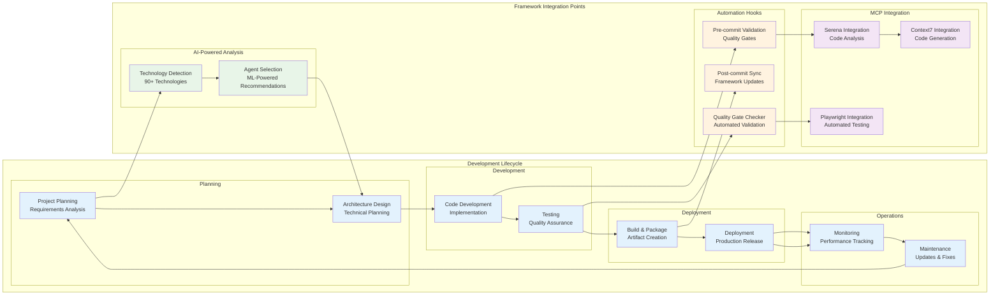

# Claude Code Multi-Agent Framework - Technology Stack Integration

## 1. Complete Technology Stack Support Map

```mermaid
graph TB
    subgraph "CLAUDE CODE FRAMEWORK"
        subgraph "Core Framework"
            CLAUDE[CLAUDE.md<br/>Project Configuration]
            AI_CORE[AI Detection Engine<br/>90+ Technologies]
            AGENTS[45 Specialized Agents<br/>Technology Adaptive]
        end
    end

    subgraph "FRONTEND TECHNOLOGIES"
        subgraph "JavaScript Frameworks"
            REACT[React<br/>Component Architecture]
            ANGULAR[Angular<br/>Enterprise Applications]
            VUE[Vue.js<br/>Progressive Framework]
            SVELTE[Svelte<br/>Compile-time Optimization]
        end

        subgraph "Frontend Tools"
            WEBPACK[Webpack<br/>Module Bundling]
            VITE[Vite<br/>Fast Build Tool]
            TAILWIND[Tailwind CSS<br/>Utility-first CSS]
            SASS[Sass/SCSS<br/>CSS Preprocessing]
        end

        subgraph "Desktop Frameworks"
            ELECTRON[Electron<br/>Cross-platform Desktop]
            WXWIDGETS[wxWidgets<br/>Native C++/Python GUI]
            QT[Qt<br/>Cross-platform Development]
            TAURI[Tauri<br/>Rust-based Desktop]
        end
    end

    subgraph "BACKEND TECHNOLOGIES"
        subgraph "Runtime Environments"
            NODEJS[Node.js<br/>JavaScript Runtime]
            PYTHON[Python<br/>Django, FastAPI, Flask]
            JAVA[Java<br/>Spring Boot, Enterprise]
            GOLANG[Go<br/>High Performance]
            RUST[Rust<br/>Systems Programming]
            DOTNET[.NET Core<br/>Cross-platform]
        end

        subgraph "API Technologies"
            REST[REST APIs<br/>HTTP/JSON]
            GRAPHQL[GraphQL<br/>Query Language]
            GRPC[gRPC<br/>High Performance RPC]
            WEBSOCKET[WebSockets<br/>Real-time Communication]
        end
    end

    subgraph "DATABASE TECHNOLOGIES"
        subgraph "Relational Databases"
            POSTGRES[PostgreSQL<br/>Advanced SQL]
            MYSQL[MySQL<br/>Web Applications]
            SQLITE[SQLite<br/>Embedded Database]
            MSSQL[SQL Server<br/>Enterprise Database]
        end

        subgraph "NoSQL Databases"
            MONGODB[MongoDB<br/>Document Database]
            REDIS[Redis<br/>In-memory Cache]
            ELASTICSEARCH[Elasticsearch<br/>Search Engine]
            CASSANDRA[Cassandra<br/>Distributed Database]
        end
    end

    subgraph "CLOUD & INFRASTRUCTURE"
        subgraph "Cloud Platforms"
            AWS[Amazon Web Services<br/>Comprehensive Cloud]
            AZURE[Microsoft Azure<br/>Enterprise Cloud]
            GCP[Google Cloud Platform<br/>AI/ML Focus]
            DIGITALOCEAN[DigitalOcean<br/>Developer-friendly]
        end

        subgraph "Container Technologies"
            DOCKER[Docker<br/>Containerization]
            KUBERNETES[Kubernetes<br/>Container Orchestration]
            COMPOSE[Docker Compose<br/>Multi-container Apps]
            HELM[Helm<br/>Kubernetes Packages]
        end
    end

    subgraph "SPECIALIZED TECHNOLOGIES"
        subgraph "Graphics & Gaming"
            OPENGL[OpenGL<br/>3D Graphics Programming]
            VULKAN[Vulkan<br/>Low-level Graphics API]
            UNITY[Unity<br/>Game Development]
            UNREAL[Unreal Engine<br/>Advanced Graphics]
        end

        subgraph "Embedded & IoT"
            ARDUINO[Arduino<br/>Microcontroller Platform]
            ESP32[ESP32<br/>WiFi/Bluetooth MCU]
            RASPBERRYPI[Raspberry Pi<br/>Single Board Computer]
            FREERTOS[FreeRTOS<br/>Real-time OS]
        end

        subgraph "AI & Machine Learning"
            TENSORFLOW[TensorFlow<br/>Machine Learning]
            PYTORCH[PyTorch<br/>Deep Learning]
            SCIKIT[Scikit-learn<br/>Machine Learning]
            NUMPY[NumPy<br/>Numerical Computing]
        end

        subgraph "CAD & Engineering"
            FREECAD[FreeCAD<br/>Parametric 3D Modeling]
            BLENDER[Blender<br/>3D Creation Suite]
            AUTOCAD[AutoCAD<br/>2D/3D CAD]
            SOLIDWORKS[SolidWorks<br/>3D CAD Design]
        end
    end

    %% Core Framework Connections
    AI_CORE --> CLAUDE
    CLAUDE --> AGENTS

    %% Frontend Technology Connections
    AI_CORE --> REACT
    AI_CORE --> ANGULAR
    AI_CORE --> VUE
    AI_CORE --> WXWIDGETS
    AI_CORE --> QT

    AGENTS --> REACT
    AGENTS --> ANGULAR
    AGENTS --> VUE
    AGENTS --> WXWIDGETS

    %% Backend Technology Connections
    AI_CORE --> NODEJS
    AI_CORE --> PYTHON
    AI_CORE --> JAVA
    AI_CORE --> GOLANG

    AGENTS --> NODEJS
    AGENTS --> PYTHON
    AGENTS --> JAVA

    %% Database Technology Connections
    AI_CORE --> POSTGRES
    AI_CORE --> MONGODB
    AI_CORE --> REDIS

    AGENTS --> POSTGRES
    AGENTS --> MONGODB

    %% Cloud & Infrastructure Connections
    AI_CORE --> AWS
    AI_CORE --> AZURE
    AI_CORE --> DOCKER
    AI_CORE --> KUBERNETES

    AGENTS --> AWS
    AGENTS --> DOCKER
    AGENTS --> KUBERNETES

    %% Specialized Technology Connections
    AI_CORE --> OPENGL
    AI_CORE --> ARDUINO
    AI_CORE --> TENSORFLOW
    AI_CORE --> FREECAD

    AGENTS --> OPENGL
    AGENTS --> ARDUINO
    AGENTS --> TENSORFLOW
    AGENTS --> FREECAD

    classDef framework fill:#e3f2fd
    classDef frontend fill:#e8f5e8
    classDef backend fill:#fff3e0
    classDef database fill:#f3e5f5
    classDef cloud fill:#e0f2f1
    classDef specialized fill:#ffebee

    class CLAUDE,AI_CORE,AGENTS framework
    class REACT,ANGULAR,VUE,WXWIDGETS,QT frontend
    class NODEJS,PYTHON,JAVA,GOLANG backend
    class POSTGRES,MONGODB,REDIS database
    class AWS,AZURE,DOCKER,KUBERNETES cloud
    class OPENGL,ARDUINO,TENSORFLOW,FREECAD specialized
```

## 2. MCP Tools Integration Architecture

```mermaid
graph TB
    subgraph "My Name Is Claude"
        FRAMEWORK[Framework Core<br/>Agent Orchestration]
        MCP_MANAGER[MCP Tools Manager<br/>32 Professional Tools]
    end

    subgraph "Core MCP Tools"
        SERENA[Serena<br/>🔍 Project Indexing<br/>Code Analysis & Navigation]
        CONTEXT7[Context7<br/>🧠 Advanced Context Analysis<br/>Intelligent Code Generation]
        PLAYWRIGHT[Playwright<br/>🎭 Web Automation<br/>E2E Testing & Validation]
    end

    subgraph "Development MCP Tools"
        subgraph "Code Quality"
            ESLINT[ESLint MCP<br/>JavaScript Linting]
            PRETTIER[Prettier MCP<br/>Code Formatting]
            SONARQUBE[SonarQube MCP<br/>Code Analysis]
        end

        subgraph "Testing Tools"
            JEST[Jest MCP<br/>JavaScript Testing]
            PYTEST[Pytest MCP<br/>Python Testing]
            CYPRESS[Cypress MCP<br/>E2E Testing]
        end

        subgraph "Build Tools"
            WEBPACK_MCP[Webpack MCP<br/>Module Bundling]
            VITE_MCP[Vite MCP<br/>Fast Building]
            DOCKER_MCP[Docker MCP<br/>Containerization]
        end
    end

    subgraph "Database MCP Tools"
        POSTGRES_MCP[PostgreSQL MCP<br/>Database Management]
        MONGODB_MCP[MongoDB MCP<br/>Document Database]
        REDIS_MCP[Redis MCP<br/>Cache Management]
    end

    subgraph "Cloud MCP Tools"
        AWS_MCP[AWS MCP<br/>Cloud Services]
        AZURE_MCP[Azure MCP<br/>Microsoft Cloud]
        GCP_MCP[GCP MCP<br/>Google Cloud]
        K8S_MCP[Kubernetes MCP<br/>Container Orchestration]
    end

    subgraph "Monitoring MCP Tools"
        PROMETHEUS[Prometheus MCP<br/>Metrics Collection]
        GRAFANA[Grafana MCP<br/>Visualization]
        ELASTIC[Elasticsearch MCP<br/>Log Analysis]
    end

    subgraph "Specialized MCP Tools"
        BLENDER_MCP[Blender MCP<br/>3D Content Creation]
        CAD_MCP[CAD MCP<br/>Engineering Design]
        ARDUINO_MCP[Arduino MCP<br/>Embedded Development]
    end

    %% Framework Integration
    FRAMEWORK --> MCP_MANAGER
    MCP_MANAGER --> SERENA
    MCP_MANAGER --> CONTEXT7
    MCP_MANAGER --> PLAYWRIGHT

    %% Development Tools Integration
    MCP_MANAGER --> ESLINT
    MCP_MANAGER --> JEST
    MCP_MANAGER --> WEBPACK_MCP

    %% Database Tools Integration
    MCP_MANAGER --> POSTGRES_MCP
    MCP_MANAGER --> MONGODB_MCP
    MCP_MANAGER --> REDIS_MCP

    %% Cloud Tools Integration
    MCP_MANAGER --> AWS_MCP
    MCP_MANAGER --> K8S_MCP

    %% Monitoring Tools Integration
    MCP_MANAGER --> PROMETHEUS
    MCP_MANAGER --> GRAFANA

    %% Specialized Tools Integration
    MCP_MANAGER --> BLENDER_MCP
    MCP_MANAGER --> ARDUINO_MCP

    classDef framework fill:#e3f2fd
    classDef core fill:#e8f5e8
    classDef development fill:#fff3e0
    classDef database fill:#f3e5f5
    classDef cloud fill:#e0f2f1
    classDef monitoring fill:#ffebee
    classDef specialized fill:#fafafa

    class FRAMEWORK,MCP_MANAGER framework
    class SERENA,CONTEXT7,PLAYWRIGHT core
    class ESLINT,JEST,WEBPACK_MCP development
    class POSTGRES_MCP,MONGODB_MCP,REDIS_MCP database
    class AWS_MCP,K8S_MCP cloud
    class PROMETHEUS,GRAFANA monitoring
    class BLENDER_MCP,ARDUINO_MCP specialized
```

## 3. Development Lifecycle Integration

## 4. Enterprise System Integration

```mermaid
graph TB
    subgraph "My Name Is Claude"
        CORE[Framework Core<br/>Enterprise Ready]
        ENTERPRISE_AGENTS[Enterprise Agents<br/>24 Specialized Agents]
    end

    subgraph "Enterprise Development Tools"
        subgraph "Version Control"
            GITHUB_ENT[GitHub Enterprise<br/>Enterprise Git Hosting]
            GITLAB_ENT[GitLab Enterprise<br/>DevOps Platform]
            BITBUCKET[Bitbucket<br/>Atlassian Integration]
        end

        subgraph "CI/CD Platforms"
            JENKINS[Jenkins<br/>Automation Server]
            AZURE_DEVOPS[Azure DevOps<br/>Microsoft Platform]
            GITHUB_ACTIONS[GitHub Actions<br/>Workflow Automation]
            GITLAB_CI[GitLab CI<br/>Integrated Pipeline]
        end

        subgraph "Project Management"
            JIRA[Jira<br/>Issue Tracking]
            AZURE_BOARDS[Azure Boards<br/>Work Item Tracking]
            CONFLUENCE[Confluence<br/>Documentation]
        end
    end

    subgraph "Enterprise Infrastructure"
        subgraph "Cloud Platforms"
            AWS_ENT[AWS Enterprise<br/>Comprehensive Cloud]
            AZURE_ENT[Azure Enterprise<br/>Microsoft Ecosystem]
            GCP_ENT[GCP Enterprise<br/>Google Cloud]
        end

        subgraph "Container Orchestration"
            OPENSHIFT[OpenShift<br/>Enterprise Kubernetes]
            RANCHER[Rancher<br/>Kubernetes Management]
            EKS[AWS EKS<br/>Managed Kubernetes]
            AKS[Azure AKS<br/>Azure Kubernetes]
        end

        subgraph "Monitoring & Observability"
            DATADOG[Datadog<br/>Application Monitoring]
            NEW_RELIC[New Relic<br/>Performance Monitoring]
            SPLUNK[Splunk<br/>Log Analytics]
            DYNATRACE[Dynatrace<br/>AI-powered Monitoring]
        end
    end

    subgraph "Enterprise Security & Compliance"
        subgraph "Security Tools"
            VERACODE[Veracode<br/>Security Testing]
            CHECKMARX[Checkmarx<br/>SAST Analysis]
            SNYK[Snyk<br/>Vulnerability Management]
        end

        subgraph "Compliance Platforms"
            COMPLIANCE_MANAGER[Compliance Manager<br/>Regulatory Compliance]
            AUDIT_TOOLS[Audit Tools<br/>SOX, HIPAA, GDPR]
            GOVERNANCE[Governance Platform<br/>Enterprise Governance]
        end
    end

    %% Framework to Enterprise Tools
    CORE --> ENTERPRISE_AGENTS
    ENTERPRISE_AGENTS --> GITHUB_ENT
    ENTERPRISE_AGENTS --> JENKINS
    ENTERPRISE_AGENTS --> JIRA

    %% Infrastructure Integration
    ENTERPRISE_AGENTS --> AWS_ENT
    ENTERPRISE_AGENTS --> OPENSHIFT
    ENTERPRISE_AGENTS --> DATADOG

    %% Security & Compliance Integration
    ENTERPRISE_AGENTS --> VERACODE
    ENTERPRISE_AGENTS --> COMPLIANCE_MANAGER
    ENTERPRISE_AGENTS --> AUDIT_TOOLS

    classDef framework fill:#e3f2fd
    classDef devTools fill:#e8f5e8
    classDef infrastructure fill:#fff3e0
    classDef security fill:#ffebee

    class CORE,ENTERPRISE_AGENTS framework
    class GITHUB_ENT,JENKINS,JIRA devTools
    class AWS_ENT,OPENSHIFT,DATADOG infrastructure
    class VERACODE,COMPLIANCE_MANAGER,AUDIT_TOOLS security
```

## Technology Integration Patterns

### 🎯 Intelligent Technology Detection
- **90+ Technologies Supported**: Comprehensive coverage of modern tech stacks
- **97% Confidence Rating**: ML-powered accurate technology identification
- **Automatic Agent Selection**: Optimal agent team recommendations
- **Real-time Adaptation**: Dynamic adjustment to project changes

### 🔗 MCP Tools Ecosystem
- **32 Professional Tools**: Comprehensive development tool coverage
- **Smart Recommendations**: Technology stack-aware tool suggestions
- **Seamless Integration**: Native framework integration patterns
- **Enterprise-Grade**: Production-ready tool management

### ⚡ Development Lifecycle Integration
- **End-to-End Coverage**: Complete development lifecycle support
- **Quality Gates**: Automated validation at every stage
- **Continuous Integration**: Seamless CI/CD pipeline integration
- **Performance Monitoring**: Real-time system health tracking

### 🏢 Enterprise System Support
- **Fortune 500 Ready**: Complete enterprise platform integration
- **Compliance Automation**: Regulatory requirement automation
- **Security Integration**: Enterprise security tool coordination
- **Governance Support**: Enterprise governance and audit integration

### 🔄 Integration Benefits
- **Reduced Setup Time**: 50%+ faster project initialization
- **Improved Quality**: Automated quality gates and validation
- **Enhanced Productivity**: AI-powered development acceleration
- **Enterprise Compliance**: Automatic regulatory compliance support