# Claude Code Multi-Agent Framework - User Journey Flowcharts

## 1. Beginner User Journey (First-Time Setup)

```mermaid
flowchart TD
    START[👋 New to Claude Code Framework] --> DISCOVER{How did you discover?}

    DISCOVER -->|Documentation| READ_DOCS[📖 Read README.md<br/>⏱️ 5 minutes]
    DISCOVER -->|Recommendation| QUICK_START[🚀 Quick Start Guide<br/>⏱️ 3 minutes]
    DISCOVER -->|Trial| EXPLORE[🔍 Explore Features<br/>⏱️ 10 minutes]

    READ_DOCS --> INSTALL[📥 Framework Installation<br/>⏱️ 5 minutes]
    QUICK_START --> INSTALL
    EXPLORE --> INSTALL

    INSTALL --> SETUP_WIZARD[🧙 Interactive Setup Wizard<br/>⏱️ 3 minutes]
    SETUP_WIZARD --> PROJECT_DETECT[🔍 Technology Detection<br/>⏱️ 1 minute]
    PROJECT_DETECT --> AGENT_RECOMMEND[🤖 Agent Recommendations<br/>⏱️ 30 seconds]

    AGENT_RECOMMEND --> CLAUDE_GENERATE[📝 Generate CLAUDE.md<br/>⏱️ 1 minute]
    CLAUDE_GENERATE --> FIRST_TASK[✨ First Development Task<br/>⏱️ 10 minutes]

    FIRST_TASK --> SUCCESS{Task Successful?}
    SUCCESS -->|Yes| BEGINNER_COMPLETE[🎉 Beginner Journey Complete<br/>Ready for Intermediate]
    SUCCESS -->|No| HELP[❓ Get Help<br/>Documentation & Troubleshooting]
    HELP --> FIRST_TASK

    BEGINNER_COMPLETE --> INTERMEDIATE_JOURNEY[➡️ Continue to Intermediate Journey]

    classDef start fill:#e3f2fd
    classDef process fill:#e8f5e8
    classDef decision fill:#fff3e0
    classDef success fill:#c8e6c9
    classDef help fill:#ffecb3

    class START start
    class READ_DOCS,QUICK_START,EXPLORE,INSTALL,SETUP_WIZARD,PROJECT_DETECT,AGENT_RECOMMEND,CLAUDE_GENERATE,FIRST_TASK process
    class DISCOVER,SUCCESS decision
    class BEGINNER_COMPLETE,INTERMEDIATE_JOURNEY success
    class HELP help
```

## 2. Intermediate User Journey (Feature Exploration)

```mermaid
flowchart TD
    INTERMEDIATE_START[🎯 Intermediate User Journey] --> EXPLORE_AGENTS[🤖 Explore Agent Ecosystem<br/>⏱️ 15 minutes]

    EXPLORE_AGENTS --> AGENT_DISCOVERY[🔍 Agent Discovery System<br/>Browse 45 Agents]
    AGENT_DISCOVERY --> CHOOSE_PATH{Choose Development Path}

    CHOOSE_PATH -->|Web Development| WEB_AGENTS[💻 Frontend/Backend Agents<br/>React, Node.js, APIs]
    CHOOSE_PATH -->|Enterprise Project| ENTERPRISE_AGENTS[🏢 Enterprise Agents<br/>SRE, Governance, Compliance]
    CHOOSE_PATH -->|Custom Technology| CUSTOM_AGENTS[🔧 Custom Agents<br/>Graphics, Hardware, Desktop]

    WEB_AGENTS --> WEB_WORKFLOW[🔄 Web Development Workflow<br/>⏱️ 30 minutes]
    ENTERPRISE_AGENTS --> ENTERPRISE_WORKFLOW[🏢 Enterprise Workflow<br/>⏱️ 45 minutes]
    CUSTOM_AGENTS --> CUSTOM_WORKFLOW[🎨 Custom Technology Workflow<br/>⏱️ 40 minutes]

    WEB_WORKFLOW --> MCP_TOOLS[🛠️ Explore MCP Tools<br/>⏱️ 20 minutes]
    ENTERPRISE_WORKFLOW --> MCP_TOOLS
    CUSTOM_WORKFLOW --> MCP_TOOLS

    MCP_TOOLS --> SERENA[📊 Serena Integration<br/>Code Analysis]
    MCP_TOOLS --> CONTEXT7[🧠 Context7 Integration<br/>Code Generation]
    MCP_TOOLS --> PLAYWRIGHT[🎭 Playwright Integration<br/>Testing Automation]

    SERENA --> ADVANCED_FEATURES[⚡ Advanced Features<br/>⏱️ 25 minutes]
    CONTEXT7 --> ADVANCED_FEATURES
    PLAYWRIGHT --> ADVANCED_FEATURES

    ADVANCED_FEATURES --> MULTI_AGENT[🤝 Multi-Agent Coordination<br/>Complex Workflows]
    MULTI_AGENT --> QUALITY_GATES[✅ Quality Gates<br/>Automated Validation]
    QUALITY_GATES --> INTERMEDIATE_COMPLETE[🎉 Intermediate Journey Complete<br/>Ready for Expert Level]

    INTERMEDIATE_COMPLETE --> EXPERT_JOURNEY[➡️ Continue to Expert Journey]

    classDef start fill:#e3f2fd
    classDef exploration fill:#e8f5e8
    classDef workflow fill:#fff3e0
    classDef tools fill:#f3e5f5
    classDef advanced fill:#e0f2f1
    classDef complete fill:#c8e6c9

    class INTERMEDIATE_START start
    class EXPLORE_AGENTS,AGENT_DISCOVERY exploration
    class WEB_AGENTS,ENTERPRISE_AGENTS,CUSTOM_AGENTS,WEB_WORKFLOW,ENTERPRISE_WORKFLOW,CUSTOM_WORKFLOW workflow
    class MCP_TOOLS,SERENA,CONTEXT7,PLAYWRIGHT tools
    class ADVANCED_FEATURES,MULTI_AGENT,QUALITY_GATES advanced
    class INTERMEDIATE_COMPLETE,EXPERT_JOURNEY complete
```

## 3. Expert User Journey (Customization & Optimization)

```mermaid
flowchart TD
    EXPERT_START[🚀 Expert User Journey] --> CUSTOMIZATION[⚙️ Framework Customization<br/>⏱️ 45 minutes]

    CUSTOMIZATION --> CUSTOM_AGENTS[🤖 Create Custom Agents<br/>Organization-specific]
    CUSTOMIZATION --> CUSTOM_PROMPTS[📝 Create Custom Prompts<br/>Workflow optimization]
    CUSTOMIZATION --> CUSTOM_HOOKS[🔗 Create Custom Hooks<br/>Automation enhancement]

    CUSTOM_AGENTS --> AGENT_TEMPLATES[📋 Agent Templates<br/>Standardized Creation]
    CUSTOM_PROMPTS --> PROMPT_QUALITY[✅ Prompt Quality Standards<br/>4-Component Structure]
    CUSTOM_HOOKS --> HOOK_INTEGRATION[🔄 Hook Integration<br/>Lifecycle Management]

    AGENT_TEMPLATES --> ADVANCED_CONFIG[🔧 Advanced Configuration<br/>⏱️ 30 minutes]
    PROMPT_QUALITY --> ADVANCED_CONFIG
    HOOK_INTEGRATION --> ADVANCED_CONFIG

    ADVANCED_CONFIG --> PERFORMANCE_OPT[⚡ Performance Optimization<br/>Framework Tuning]
    PERFORMANCE_OPT --> MONITORING[📊 Performance Monitoring<br/>Metrics & Analytics]
    MONITORING --> SCALING[📈 Scaling Strategies<br/>Enterprise Deployment]

    SCALING --> TEAM_SETUP[👥 Team Setup<br/>⏱️ 60 minutes]
    TEAM_SETUP --> MULTI_PROJECT[📂 Multi-Project Management<br/>Portfolio Organization]
    MULTI_PROJECT --> GOVERNANCE[⚖️ Governance Setup<br/>Enterprise Standards]

    GOVERNANCE --> AUTOMATION[🤖 Advanced Automation<br/>⏱️ 45 minutes]
    AUTOMATION --> CI_CD_INTEGRATION[🔄 CI/CD Integration<br/>Pipeline Automation]
    CI_CD_INTEGRATION --> MONITORING_SETUP[📊 Monitoring Setup<br/>Observability Stack]

    MONITORING_SETUP --> EXPERT_COMPLETE[🎉 Expert Journey Complete<br/>Framework Master]
    EXPERT_COMPLETE --> ENTERPRISE_JOURNEY[➡️ Ready for Enterprise Journey]

    classDef start fill:#e3f2fd
    classDef customization fill:#e8f5e8
    classDef templates fill:#fff3e0
    classDef configuration fill:#f3e5f5
    classDef optimization fill:#e0f2f1
    classDef team fill:#ffebee
    classDef automation fill:#fafafa
    classDef complete fill:#c8e6c9

    class EXPERT_START start
    class CUSTOM_AGENTS,CUSTOM_PROMPTS,CUSTOM_HOOKS customization
    class AGENT_TEMPLATES,PROMPT_QUALITY,HOOK_INTEGRATION templates
    class ADVANCED_CONFIG,PERFORMANCE_OPT,MONITORING,SCALING configuration
    class TEAM_SETUP,MULTI_PROJECT,GOVERNANCE team
    class AUTOMATION,CI_CD_INTEGRATION,MONITORING_SETUP automation
    class EXPERT_COMPLETE,ENTERPRISE_JOURNEY complete
```

## 4. Enterprise User Journey (Fortune 500 Deployment)

```mermaid
flowchart TD
    ENTERPRISE_START[🏢 Enterprise User Journey] --> ASSESSMENT[📊 Enterprise Assessment<br/>⏱️ 2 weeks]

    ASSESSMENT --> COMPLIANCE_REVIEW[⚖️ Compliance Review<br/>SOX, HIPAA, GDPR]
    COMPLIANCE_REVIEW --> SECURITY_AUDIT[🔒 Security Audit<br/>Enterprise Security]
    SECURITY_AUDIT --> ARCHITECTURE_REVIEW[🏗️ Architecture Review<br/>Enterprise Scale]

    ARCHITECTURE_REVIEW --> PILOT_PROJECT[🧪 Pilot Project<br/>⏱️ 4 weeks]
    PILOT_PROJECT --> PILOT_SUCCESS{Pilot Successful?}

    PILOT_SUCCESS -->|Yes| ENTERPRISE_ROLLOUT[🚀 Enterprise Rollout<br/>⏱️ 12 weeks]
    PILOT_SUCCESS -->|No| PILOT_ADJUSTMENT[🔧 Pilot Adjustment<br/>Issue Resolution]
    PILOT_ADJUSTMENT --> PILOT_PROJECT

    ENTERPRISE_ROLLOUT --> PHASE1[📋 Phase 1: Core Teams<br/>⏱️ 4 weeks]
    PHASE1 --> PHASE2[📈 Phase 2: Department Rollout<br/>⏱️ 4 weeks]
    PHASE2 --> PHASE3[🌐 Phase 3: Organization-wide<br/>⏱️ 4 weeks]

    PHASE3 --> GOVERNANCE_SETUP[⚖️ Governance Implementation<br/>⏱️ 2 weeks]
    GOVERNANCE_SETUP --> COMPLIANCE_AUTOMATION[🤖 Compliance Automation<br/>Regulatory Integration]
    COMPLIANCE_AUTOMATION --> MONITORING_DEPLOYMENT[📊 Enterprise Monitoring<br/>Observability Stack]

    MONITORING_DEPLOYMENT --> TRAINING_PROGRAM[🎓 Training Program<br/>⏱️ 6 weeks]
    TRAINING_PROGRAM --> BEGINNER_TRAINING[👨‍🎓 Beginner Training<br/>Framework Basics]
    TRAINING_PROGRAM --> ADVANCED_TRAINING[👨‍💼 Advanced Training<br/>Enterprise Features]
    TRAINING_PROGRAM --> ADMIN_TRAINING[👨‍💻 Admin Training<br/>System Management]

    BEGINNER_TRAINING --> CERTIFICATION[🏆 Certification Program<br/>⏱️ 4 weeks]
    ADVANCED_TRAINING --> CERTIFICATION
    ADMIN_TRAINING --> CERTIFICATION

    CERTIFICATION --> OPTIMIZATION[⚡ Performance Optimization<br/>⏱️ 4 weeks]
    OPTIMIZATION --> METRICS[📊 Success Metrics<br/>ROI Measurement]
    METRICS --> CONTINUOUS_IMPROVEMENT[🔄 Continuous Improvement<br/>Ongoing Enhancement]

    CONTINUOUS_IMPROVEMENT --> ENTERPRISE_COMPLETE[🎉 Enterprise Deployment Complete<br/>Fortune 500 Ready]

    classDef start fill:#e3f2fd
    classDef assessment fill:#e8f5e8
    classDef pilot fill:#fff3e0
    classDef rollout fill:#f3e5f5
    classDef governance fill:#e0f2f1
    classDef training fill:#ffebee
    classDef optimization fill:#fafafa
    classDef complete fill:#c8e6c9

    class ENTERPRISE_START start
    class ASSESSMENT,COMPLIANCE_REVIEW,SECURITY_AUDIT,ARCHITECTURE_REVIEW assessment
    class PILOT_PROJECT,PILOT_ADJUSTMENT pilot
    class ENTERPRISE_ROLLOUT,PHASE1,PHASE2,PHASE3 rollout
    class GOVERNANCE_SETUP,COMPLIANCE_AUTOMATION,MONITORING_DEPLOYMENT governance
    class TRAINING_PROGRAM,BEGINNER_TRAINING,ADVANCED_TRAINING,ADMIN_TRAINING,CERTIFICATION training
    class OPTIMIZATION,METRICS,CONTINUOUS_IMPROVEMENT optimization
    class ENTERPRISE_COMPLETE complete
```

## 5. Learning Path Progression Map

```mermaid
graph TD
    subgraph "Skill Development Progression"
        subgraph "Beginner Level (Day 1-7)"
            B1[📖 Framework Understanding<br/>Basic Concepts]
            B2[⚙️ Initial Setup<br/>Installation & Configuration]
            B3[🎯 First Task<br/>Simple Development Task]
            B4[✅ Success Validation<br/>Task Completion]
        end

        subgraph "Intermediate Level (Week 2-4)"
            I1[🤖 Agent Exploration<br/>Understanding Agent Ecosystem]
            I2[🛠️ Tool Integration<br/>MCP Tools Usage]
            I3[🔄 Workflow Design<br/>Multi-Agent Coordination]
            I4[⚡ Feature Utilization<br/>Advanced Framework Features]
        end

        subgraph "Expert Level (Month 2-3)"
            E1[⚙️ Customization<br/>Custom Agents & Prompts]
            E2[📊 Optimization<br/>Performance Tuning]
            E3[👥 Team Leadership<br/>Framework Evangelism]
            E4[🔧 Administration<br/>System Management]
        end

        subgraph "Enterprise Level (Month 4-12)"
            ENT1[🏢 Enterprise Planning<br/>Large-scale Deployment]
            ENT2[⚖️ Governance<br/>Compliance & Standards]
            ENT3[📈 Scaling<br/>Organization-wide Rollout]
            ENT4[🎓 Training<br/>Enterprise Education Program]
        end
    end

    subgraph "Learning Resources"
        DOC[📚 Documentation<br/>Complete Guides]
        VIDEO[🎥 Video Tutorials<br/>Step-by-step Learning]
        COMMUNITY[👥 Community<br/>Peer Support]
        SUPPORT[🆘 Expert Support<br/>Professional Help]
    end

    subgraph "Skill Validation"
        CERT1[🏅 Basic Certification<br/>Framework Fundamentals]
        CERT2[🏆 Advanced Certification<br/>Expert-level Skills]
        CERT3[👑 Master Certification<br/>Enterprise Leadership]
    end

    %% Progression Flow
    B1 --> B2 --> B3 --> B4
    B4 --> I1
    I1 --> I2 --> I3 --> I4
    I4 --> E1
    E1 --> E2 --> E3 --> E4
    E4 --> ENT1
    ENT1 --> ENT2 --> ENT3 --> ENT4

    %% Learning Resources Integration
    B1 --> DOC
    I1 --> VIDEO
    E1 --> COMMUNITY
    ENT1 --> SUPPORT

    %% Certification Points
    B4 --> CERT1
    I4 --> CERT1
    E4 --> CERT2
    ENT4 --> CERT3

    classDef beginner fill:#e3f2fd
    classDef intermediate fill:#e8f5e8
    classDef expert fill:#fff3e0
    classDef enterprise fill:#f3e5f5
    classDef resources fill:#e0f2f1
    classDef certification fill:#ffebee

    class B1,B2,B3,B4 beginner
    class I1,I2,I3,I4 intermediate
    class E1,E2,E3,E4 expert
    class ENT1,ENT2,ENT3,ENT4 enterprise
    class DOC,VIDEO,COMMUNITY,SUPPORT resources
    class CERT1,CERT2,CERT3 certification
```

## User Journey Success Metrics

### 🎯 Beginner Success Indicators
- **Time to First Task**: <20 minutes from framework installation
- **Setup Success Rate**: 95%+ successful first-time setup
- **Task Completion Rate**: 90%+ first task completion
- **User Satisfaction**: 4.5/5 stars for ease of use

### 📈 Intermediate Success Indicators
- **Feature Adoption**: 70%+ adoption of advanced features
- **Agent Utilization**: Average 8-12 agents used per project
- **MCP Tool Integration**: 60%+ users integrate MCP tools
- **Workflow Efficiency**: 40%+ improvement in development speed

### 🚀 Expert Success Indicators
- **Customization Rate**: 50%+ create custom agents or prompts
- **Performance Optimization**: 30%+ framework performance improvement
- **Team Leadership**: 80%+ become framework advocates
- **Knowledge Sharing**: Active community participation

### 🏢 Enterprise Success Indicators
- **Deployment Success**: 98%+ successful enterprise deployments
- **Compliance Achievement**: 100% regulatory compliance maintenance
- **ROI Realization**: 300%+ return on investment within 12 months
- **Organization Adoption**: 90%+ employee framework utilization

## Journey Optimization Features

### 🎯 Adaptive Learning Paths
- **Skill Assessment**: Automatic user skill level detection
- **Personalized Recommendations**: Customized learning progression
- **Progress Tracking**: Real-time skill development monitoring
- **Achievement Recognition**: Milestone celebration and badges

### 🔄 Continuous Improvement
- **User Feedback Integration**: Journey optimization based on user input
- **Analytics-Driven Enhancement**: Data-driven journey improvements
- **Success Pattern Analysis**: Identification of optimal learning paths
- **Bottleneck Resolution**: Proactive elimination of user friction points