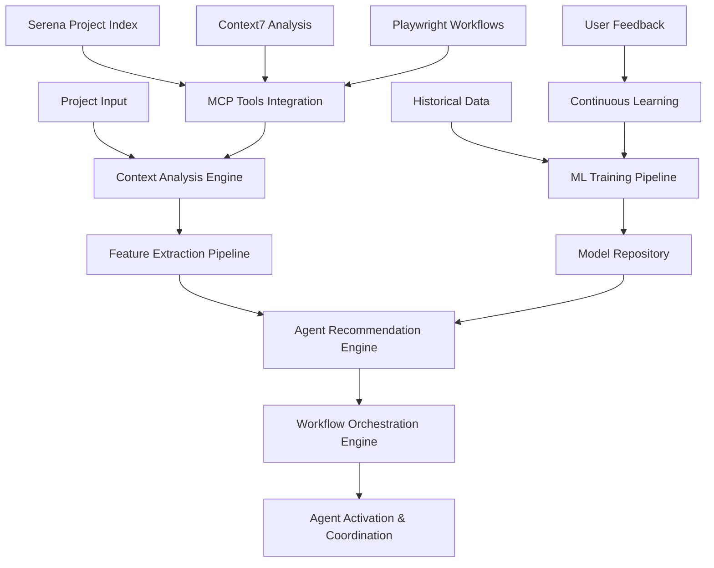

# AI-Powered Agent Selection - Technical Design Document

**Project**: Claude Code Multi-Agent Framework Enhancement
**Version**: 1.0.0
**Date**: 2025-09-16
**Status**: Phase 1 - Foundation Design

---

## 📋 Executive Summary

This technical design document outlines the implementation of AI-Powered Agent Selection functionality for the Claude Code Multi-Agent Framework. The system will use machine learning to automatically select optimal agents based on project context, targeting a 50% reduction in project setup time while maintaining 90%+ accuracy.

### Key Components
- **Context Analysis Engine**: Intelligent project analysis and feature extraction
- **Agent Recommendation Engine**: ML-based optimal agent selection using ensemble models
- **Workflow Orchestration Engine**: Dynamic multi-agent workflow generation
- **Framework Integration**: Non-invasive enhancement preserving existing functionality

---

## 🏗️ System Architecture

### High-Level Architecture



### Core Components Detailed Design

#### 1. Context Analysis Engine

**Purpose**: Extract meaningful features from project context for ML model input

**Input Sources**:
```yaml
project_files:
  - source_code: "Technology stack detection from file extensions and imports"
  - configuration_files: "Framework detection from package.json, requirements.txt, etc."
  - documentation: "Project domain and complexity analysis from README, docs"
  - git_history: "Development patterns and team preferences from commit history"

framework_context:
  - claude_md: "Project specifications, technology stack, business domain"
  - existing_agents: "Currently activated agents and their effectiveness"
  - todowrite_state: "Current task breakdown and project progress"

mcp_tools_data:
  - serena_index: "Project structure analysis and file relationships"
  - context7_analysis: "Semantic code analysis and pattern recognition"
  - playwright_workflows: "Automation patterns and testing requirements"
```

**Feature Extraction Algorithm**:
```python
class ProjectContextAnalyzer:
    def analyze_project(self, project_path: str) -> ProjectContext:
        """
        Comprehensive project analysis for ML feature extraction

        Returns:
            ProjectContext with technology_stack, complexity_score,
            business_domain, team_context, and mcp_insights
        """
        context = ProjectContext()

        # Technology Stack Detection
        context.technology_stack = self._detect_technology_stack(project_path)

        # Project Complexity Assessment
        context.complexity_score = self._assess_complexity(project_path)

        # Business Domain Identification
        context.business_domain = self._identify_business_domain(project_path)

        # Team Context Analysis
        context.team_context = self._analyze_team_context(project_path)

        # MCP Tools Integration
        context.mcp_insights = self._integrate_mcp_data(project_path)

        return context

    def _detect_technology_stack(self, project_path: str) -> TechnologyStack:
        """Detect 15+ supported technology stacks"""
        detectors = {
            'frontend': FrontendDetector(),  # React, Angular, Vue, etc.
            'backend': BackendDetector(),    # Python, Node.js, Java, etc.
            'database': DatabaseDetector(),  # PostgreSQL, MongoDB, etc.
            'infrastructure': InfraDetector(), # Docker, Kubernetes, etc.
            'testing': TestingDetector(),    # Jest, Pytest, Cypress, etc.
        }

        stack = TechnologyStack()
        for category, detector in detectors.items():
            stack[category] = detector.detect(project_path)

        return stack
```

**Output Format**:
```yaml
project_context:
  technology_stack:
    frontend: ["react", "typescript", "tailwind"]
    backend: ["python", "fastapi", "sqlalchemy"]
    database: ["postgresql", "redis"]
    infrastructure: ["docker", "kubernetes"]
    testing: ["pytest", "playwright"]

  complexity_score:
    file_count: 1250
    code_lines: 45000
    complexity_rating: "enterprise"  # startup/sme/enterprise

  business_domain:
    primary: "fintech"
    secondary: ["api_integration", "data_analytics"]
    compliance_requirements: ["gdpr", "pci_dss"]

  team_context:
    size: "medium"  # small/medium/large
    experience_level: "senior"
    preferences: ["test_driven", "microservices"]

  mcp_insights:
    serena_analysis: "Complex multi-service architecture with 15 microservices"
    context7_patterns: "Heavy use of async patterns and event-driven architecture"
    playwright_coverage: "Comprehensive E2E testing infrastructure"
```

#### 2. Agent Recommendation Engine

**Purpose**: Use ML models to recommend optimal agents based on project context

**ML Model Architecture**:
```python
class AgentRecommendationEngine:
    def __init__(self):
        self.ensemble_models = {
            'random_forest': RandomForestClassifier(n_estimators=100),
            'neural_network': MLPClassifier(hidden_layer_sizes=(128, 64, 32)),
            'rule_based': RuleBasedRecommender(),
        }
        self.feature_encoder = ProjectFeatureEncoder()
        self.agent_embeddings = AgentEmbeddingGenerator()

    def recommend_agents(self, project_context: ProjectContext) -> AgentRecommendations:
        """
        Generate agent recommendations using ensemble of ML models

        Returns:
            Ranked list of agents with confidence scores and rationale
        """
        # Encode project features for ML models
        features = self.feature_encoder.encode(project_context)

        # Get recommendations from each model
        recommendations = {}
        for model_name, model in self.ensemble_models.items():
            recommendations[model_name] = model.predict_proba(features)

        # Ensemble combination with weighted voting
        final_recommendations = self._ensemble_combine(recommendations)

        # Add explainability and confidence scores
        return self._add_explainability(final_recommendations, project_context)

    def _ensemble_combine(self, recommendations: Dict) -> np.ndarray:
        """Combine multiple model predictions with weighted voting"""
        weights = {
            'random_forest': 0.4,    # Good for feature importance
            'neural_network': 0.4,   # Good for complex patterns
            'rule_based': 0.2,       # Good for business logic
        }

        combined = np.zeros_like(recommendations['random_forest'])
        for model_name, pred in recommendations.items():
            combined += weights[model_name] * pred

        return combined
```

**Training Data Structure**:
```yaml
training_data:
  features:
    - project_technology_stack: "One-hot encoded technology vectors"
    - project_complexity_metrics: "Normalized complexity scores"
    - business_domain_embeddings: "Domain-specific requirement vectors"
    - team_context_features: "Team size, experience, preference vectors"
    - historical_success_patterns: "Past successful agent combinations"

  labels:
    - optimal_agent_selection: "Ground truth agent selections for successful projects"
    - agent_effectiveness_scores: "Performance ratings for agent-project combinations"
    - user_satisfaction_ratings: "Developer satisfaction with agent selections"

  data_sources:
    - framework_usage_logs: "6+ months of framework usage across diverse projects"
    - project_success_metrics: "100+ completed projects with success indicators"
    - user_feedback_data: "Developer satisfaction surveys and ratings"
```

**Model Performance Targets**:
```yaml
performance_targets:
  accuracy:
    training: "85% accuracy on validation set"
    production: "90% accuracy based on user feedback"

  response_time:
    inference: "<2 seconds for agent recommendation generation"
    batch_processing: "<30 seconds for workflow generation"

  explainability:
    feature_importance: "Clear explanation of why agents were recommended"
    confidence_scores: "Probabilistic confidence for each recommendation"
    alternative_suggestions: "Top 3 alternatives with rationale"
```

#### 3. Workflow Orchestration Engine

**Purpose**: Generate dynamic workflows and coordinate agent interactions

**Workflow Generation Algorithm**:
```python
class WorkflowOrchestrationEngine:
    def __init__(self, agent_recommender: AgentRecommendationEngine):
        self.agent_recommender = agent_recommender
        self.workflow_templates = WorkflowTemplateLibrary()
        self.dependency_resolver = AgentDependencyResolver()

    def generate_workflow(self, project_context: ProjectContext) -> ProjectWorkflow:
        """
        Generate optimal workflow based on recommended agents and project needs

        Returns:
            Complete project workflow with agent coordination and task breakdown
        """
        # Get agent recommendations
        agent_recommendations = self.agent_recommender.recommend_agents(project_context)

        # Resolve agent dependencies and coordination requirements
        agent_dependencies = self.dependency_resolver.resolve(agent_recommendations)

        # Generate workflow based on project type and agent capabilities
        workflow = self._generate_base_workflow(project_context, agent_recommendations)

        # Optimize workflow for efficiency and parallel execution
        optimized_workflow = self._optimize_workflow(workflow, agent_dependencies)

        # Add monitoring and adaptation capabilities
        adaptive_workflow = self._add_adaptation_capabilities(optimized_workflow)

        return adaptive_workflow

    def _generate_base_workflow(self, context: ProjectContext, agents: AgentRecommendations) -> Workflow:
        """Generate base workflow structure"""
        workflow_type = self._determine_workflow_type(context)
        template = self.workflow_templates.get_template(workflow_type)

        # Customize template with recommended agents
        customized_workflow = template.customize(agents)

        return customized_workflow
```

**Workflow Templates**:
```yaml
workflow_templates:
  web_application:
    phases:
      - initialization:
          agents: ["project-owner", "business-analyst"]
          tasks: ["project_setup", "requirements_gathering"]
      - architecture:
          agents: ["software-architect", "security-engineer"]
          tasks: ["system_design", "security_architecture"]
      - development:
          agents: ["frontend-engineer", "backend-engineer", "api-engineer"]
          tasks: ["ui_implementation", "api_development", "integration"]
      - quality_assurance:
          agents: ["qa-engineer", "security-engineer"]
          tasks: ["testing", "security_validation", "performance_optimization"]
      - deployment:
          agents: ["deployment-engineer", "sre-engineer"]
          tasks: ["ci_cd_setup", "infrastructure", "monitoring"]

  data_analytics_project:
    phases:
      - data_discovery:
          agents: ["data-engineer", "business-analyst"]
          tasks: ["data_exploration", "requirements_analysis"]
      - data_pipeline:
          agents: ["data-engineer", "backend-engineer"]
          tasks: ["etl_development", "data_validation"]
      - analytics:
          agents: ["data-scientist", "data-engineer"]
          tasks: ["model_development", "analysis", "visualization"]
      - deployment:
          agents: ["deployment-engineer", "monitoring-engineer"]
          tasks: ["model_deployment", "monitoring_setup"]
```

#### 4. Framework Integration

**Purpose**: Seamlessly integrate AI capabilities with existing framework

**Integration Points**:
```yaml
integration_architecture:
  claude_md_enhancement:
    new_section: "Section 19: AI-Powered Agent Selection Configuration"
    configuration:
      ai_enabled: true
      selection_confidence_threshold: 0.8
      fallback_to_manual: true
      learning_enabled: true
      personalization_enabled: true

  agent_prompt_binding_enhancement:
    current: "Directory-based automatic agent activation"
    enhanced: "AI-recommended agent activation with confidence scoring"
    fallback: "Existing directory-based system if AI unavailable"

  todowrite_integration:
    enhancement: "AI-powered task breakdown and agent coordination"
    features:
      - intelligent_epic_breakdown
      - optimal_agent_assignment
      - dependency_resolution
      - progress_prediction

  session_management_enhancement:
    features:
      - ai_powered_context_restoration
      - intelligent_session_continuation
      - agent_selection_optimization
      - workflow_adaptation
```

**Backward Compatibility Strategy**:
```python
class AIFrameworkIntegration:
    def __init__(self, existing_framework: ClaudeCodeFramework):
        self.framework = existing_framework
        self.ai_engine = None
        self.fallback_mode = True

    def initialize_ai_features(self) -> bool:
        """
        Initialize AI features with graceful fallback

        Returns:
            True if AI features successfully initialized, False for fallback mode
        """
        try:
            self.ai_engine = AgentRecommendationEngine()
            self.ai_engine.load_models()
            self.fallback_mode = False
            return True
        except Exception as e:
            logger.warning(f"AI features unavailable, using fallback mode: {e}")
            self.fallback_mode = True
            return False

    def select_agents(self, project_context: ProjectContext) -> AgentSelection:
        """
        Select agents with AI enhancement and fallback
        """
        if not self.fallback_mode and self.ai_engine:
            try:
                # AI-powered agent selection
                recommendations = self.ai_engine.recommend_agents(project_context)
                return self._format_ai_recommendations(recommendations)
            except Exception as e:
                logger.warning(f"AI selection failed, falling back to manual: {e}")

        # Fallback to existing directory-based selection
        return self.framework.select_agents_manual(project_context)
```

---

## 📊 Data Architecture

### Training Data Collection

**Historical Framework Usage Data**:
```yaml
data_collection:
  usage_logs:
    source: "Framework session logs and user interactions"
    format: "JSON structured logs with project context and agent selections"
    volume: "6+ months of usage data across 100+ diverse projects"

  project_success_metrics:
    source: "Project completion tracking and developer satisfaction surveys"
    format: "Structured metrics with project outcomes and satisfaction scores"
    volume: "Success metrics for all framework-assisted projects"

  agent_effectiveness_data:
    source: "Agent performance tracking and user feedback"
    format: "Agent-project-outcome mappings with effectiveness scores"
    volume: "Performance data across all 45 agents and 164 prompts"
```

**Real-time Data Streams**:
```yaml
streaming_data:
  project_analysis:
    source: "Real-time project context analysis from MCP tools"
    processing: "Stream processing with Apache Kafka + Spark"
    storage: "Time-series database for temporal pattern analysis"

  user_interactions:
    source: "User interface interactions and preference indicators"
    processing: "Real-time user behavior analysis"
    storage: "User preference database with privacy protection"

  model_performance:
    source: "Live model inference results and accuracy metrics"
    processing: "Real-time model monitoring and drift detection"
    storage: "Model performance metrics database"
```

### Feature Engineering Pipeline

**Project Context Features**:
```python
class ProjectFeatureEncoder:
    def encode_project_context(self, context: ProjectContext) -> np.ndarray:
        """
        Convert project context to ML-ready feature vectors

        Returns:
            High-dimensional feature vector suitable for ML models
        """
        features = []

        # Technology stack one-hot encoding
        tech_features = self._encode_technology_stack(context.technology_stack)
        features.extend(tech_features)

        # Project complexity numerical features
        complexity_features = self._encode_complexity(context.complexity_score)
        features.extend(complexity_features)

        # Business domain embeddings
        domain_features = self._encode_business_domain(context.business_domain)
        features.extend(domain_features)

        # Team context categorical encoding
        team_features = self._encode_team_context(context.team_context)
        features.extend(team_features)

        # MCP insights semantic embeddings
        mcp_features = self._encode_mcp_insights(context.mcp_insights)
        features.extend(mcp_features)

        return np.array(features)

    def _encode_technology_stack(self, tech_stack: TechnologyStack) -> List[float]:
        """One-hot encode technology stack with support for 15+ technologies"""
        supported_technologies = {
            'frontend': ['react', 'angular', 'vue', 'typescript', 'javascript'],
            'backend': ['python', 'nodejs', 'java', 'csharp', 'go', 'rust'],
            'database': ['postgresql', 'mysql', 'mongodb', 'redis', 'sqlite'],
            'infrastructure': ['docker', 'kubernetes', 'aws', 'azure', 'gcp'],
            'testing': ['jest', 'pytest', 'cypress', 'playwright', 'selenium']
        }

        features = []
        for category, technologies in supported_technologies.items():
            category_features = [1.0 if tech in tech_stack.get(category, []) else 0.0
                               for tech in technologies]
            features.extend(category_features)

        return features
```

**Agent Effectiveness Features**:
```python
class AgentEffectivenessEncoder:
    def encode_agent_performance(self, agent_id: str, context: ProjectContext) -> np.ndarray:
        """
        Encode agent performance features for recommendation scoring

        Returns:
            Agent effectiveness feature vector for given project context
        """
        features = []

        # Historical success rate for this agent in similar contexts
        success_rate = self._calculate_historical_success_rate(agent_id, context)
        features.append(success_rate)

        # Agent specialization alignment with project requirements
        specialization_score = self._calculate_specialization_alignment(agent_id, context)
        features.append(specialization_score)

        # User satisfaction scores for this agent
        satisfaction_score = self._get_user_satisfaction_score(agent_id)
        features.append(satisfaction_score)

        # Agent coordination effectiveness with other recommended agents
        coordination_score = self._calculate_coordination_effectiveness(agent_id, context)
        features.append(coordination_score)

        return np.array(features)
```

---

## 🧪 Testing Strategy

### ML Model Validation

**Cross-Validation Framework**:
```python
class ModelValidationFramework:
    def __init__(self):
        self.validation_splits = 5  # 5-fold cross-validation
        self.test_split = 0.2      # 80/20 train/test split

    def validate_model_performance(self, model: MLModel, data: TrainingData) -> ValidationResults:
        """
        Comprehensive model validation with multiple metrics

        Returns:
            Validation results with accuracy, precision, recall, F1, and business metrics
        """
        results = ValidationResults()

        # Standard ML metrics
        results.accuracy = self._calculate_accuracy(model, data)
        results.precision = self._calculate_precision(model, data)
        results.recall = self._calculate_recall(model, data)
        results.f1_score = self._calculate_f1_score(model, data)

        # Business-specific metrics
        results.recommendation_quality = self._assess_recommendation_quality(model, data)
        results.user_satisfaction_prediction = self._predict_user_satisfaction(model, data)
        results.time_savings_prediction = self._predict_time_savings(model, data)

        # Bias and fairness validation
        results.bias_metrics = self._assess_model_bias(model, data)

        return results

    def _assess_recommendation_quality(self, model: MLModel, data: TrainingData) -> float:
        """
        Assess recommendation quality using domain-specific metrics

        Business logic validation:
        - Do recommended agents have appropriate skills for project?
        - Are agent combinations logical and efficient?
        - Do recommendations align with project complexity and domain?
        """
        quality_scores = []

        for project, true_agents in data.get_validation_pairs():
            predicted_agents = model.recommend_agents(project)

            # Skill alignment score
            skill_alignment = self._calculate_skill_alignment(predicted_agents, project)

            # Agent combination efficiency
            combination_efficiency = self._assess_agent_combination(predicted_agents)

            # Project complexity alignment
            complexity_alignment = self._assess_complexity_alignment(predicted_agents, project)

            quality_score = (skill_alignment + combination_efficiency + complexity_alignment) / 3
            quality_scores.append(quality_score)

        return np.mean(quality_scores)
```

**A/B Testing Framework**:
```yaml
ab_testing:
  experimental_design:
    control_group: "Existing manual agent selection (50% of users)"
    test_group: "AI-powered agent selection (50% of users)"
    duration: "4 weeks for statistical significance"
    sample_size: "200+ users for 95% confidence interval"

  metrics_tracking:
    primary_metrics:
      - project_setup_time: "Time from initialization to first productive work"
      - agent_selection_accuracy: "User satisfaction with selected agents"
      - workflow_efficiency: "Project velocity and milestone completion rate"

    secondary_metrics:
      - user_satisfaction: "Overall satisfaction with AI features"
      - feature_adoption: "Usage rate of AI recommendations"
      - error_rate: "Frequency of suboptimal agent selections"

  statistical_analysis:
    significance_threshold: "p < 0.05 for statistical significance"
    effect_size: "Minimum 20% improvement for practical significance"
    confidence_interval: "95% confidence interval for all metrics"
```

### Integration Testing

**Framework Compatibility Testing**:
```python
class FrameworkIntegrationTesting:
    def test_backward_compatibility(self):
        """Ensure 100% compatibility with existing framework functionality"""
        test_cases = [
            self._test_existing_workflows_unchanged(),
            self._test_manual_agent_selection_preserved(),
            self._test_todowrite_functionality_enhanced(),
            self._test_session_management_improved(),
        ]

        for test_case in test_cases:
            assert test_case.passes(), f"Compatibility test failed: {test_case.name}"

    def test_ai_feature_integration(self):
        """Validate AI features integrate seamlessly with existing components"""
        integration_tests = [
            self._test_ai_agent_selection_with_existing_prompts(),
            self._test_workflow_generation_with_todowrite(),
            self._test_mcp_tools_integration(),
            self._test_session_management_ai_enhancement(),
        ]

        for test in integration_tests:
            assert test.passes(), f"Integration test failed: {test.name}"

    def test_fallback_mechanisms(self):
        """Ensure graceful degradation when AI features unavailable"""
        fallback_scenarios = [
            self._test_ai_service_unavailable(),
            self._test_model_inference_failure(),
            self._test_insufficient_training_data(),
            self._test_network_connectivity_issues(),
        ]

        for scenario in fallback_scenarios:
            assert scenario.graceful_fallback(), f"Fallback test failed: {scenario.name}"
```

**Performance Testing**:
```yaml
performance_testing:
  load_testing:
    concurrent_users: "1000+ concurrent users"
    project_scale: "Enterprise projects with 10,000+ files"
    response_time_target: "<2 seconds for AI recommendations"
    throughput_target: "100+ recommendations per second"

  stress_testing:
    peak_load: "5x normal load for system stress testing"
    sustained_load: "24-hour sustained high load testing"
    recovery_testing: "System recovery after resource exhaustion"

  scalability_testing:
    horizontal_scaling: "Auto-scaling validation under increasing load"
    data_volume_scaling: "Performance with large training datasets"
    multi_tenant_scaling: "Enterprise multi-project environment simulation"
```

---

## 🚀 Deployment Architecture

### Production Environment

**Microservices Architecture**:
```yaml
production_services:
  ai_inference_service:
    technology: "Python FastAPI + TensorFlow Serving"
    purpose: "ML model serving and agent recommendation generation"
    scaling: "Auto-scaling based on request volume (2-20 instances)"
    resources: "4 vCPU, 16GB RAM, GPU acceleration"
    monitoring: "Response time, model accuracy, error rate"

  workflow_orchestration_service:
    technology: "Node.js + Express + PostgreSQL"
    purpose: "Dynamic workflow generation and agent coordination"
    scaling: "Horizontal scaling with load balancing (2-10 instances)"
    resources: "2 vCPU, 8GB RAM, SSD storage"
    monitoring: "Workflow success rate, execution time, resource usage"

  data_processing_service:
    technology: "Python + Apache Kafka + Apache Spark"
    purpose: "Real-time project analysis and feature extraction"
    scaling: "Distributed processing with auto-scaling"
    resources: "8 vCPU, 32GB RAM, distributed storage"
    monitoring: "Processing latency, throughput, accuracy"

  model_training_service:
    technology: "Python + MLflow + Kubernetes Jobs"
    purpose: "Continuous model training and improvement"
    scaling: "On-demand job execution with resource allocation"
    resources: "16 vCPU, 64GB RAM, GPU for training"
    monitoring: "Training progress, model performance, resource utilization"
```

**Infrastructure Requirements**:
```yaml
infrastructure:
  compute_requirements:
    production_cluster: "Kubernetes cluster with 20+ nodes"
    gpu_acceleration: "NVIDIA RTX 4090 or equivalent for model inference"
    auto_scaling: "Dynamic scaling based on load and performance metrics"

  storage_requirements:
    model_storage: "100GB for ML models and artifacts"
    training_data: "500GB for historical training data"
    user_data: "50GB for user preferences and analytics"
    backup_storage: "1TB for complete system backup and disaster recovery"

  network_requirements:
    bandwidth: "10Gbps for enterprise deployment"
    latency: "<50ms for real-time AI recommendations"
    availability: "99.9% uptime with multi-region failover"
    security: "TLS 1.3, VPN access, WAF protection"
```

### Monitoring and Observability

**Comprehensive Monitoring Stack**:
```yaml
monitoring_architecture:
  metrics_collection:
    prometheus: "System and application metrics collection"
    grafana: "Visualization dashboards for all metrics"
    custom_metrics: "Business-specific KPIs and AI model performance"

  logging_system:
    elasticsearch: "Centralized log aggregation and search"
    kibana: "Log visualization and analysis"
    structured_logging: "JSON-formatted logs with correlation IDs"

  distributed_tracing:
    jaeger: "End-to-end request tracing across microservices"
    opentelemetry: "Standardized instrumentation and telemetry"

  alerting_system:
    prometheus_alertmanager: "Rule-based alerting with multiple channels"
    pagerduty: "Incident management and escalation"
    slack_integration: "Real-time notifications for team collaboration"
```

**Key Performance Indicators (KPIs)**:
```yaml
kpi_monitoring:
  business_metrics:
    project_setup_time_reduction: "Target: 50% reduction"
    agent_selection_accuracy: "Target: 90% user satisfaction"
    developer_productivity: "Target: 40% improvement in velocity"
    user_adoption_rate: "Target: 80% AI feature adoption within 30 days"

  technical_metrics:
    ai_inference_latency: "Target: <2 seconds"
    system_availability: "Target: 99.9% uptime"
    model_accuracy: "Target: 90% recommendation accuracy"
    resource_efficiency: "Target: <20% overhead from AI features"

  user_experience_metrics:
    user_satisfaction: "Target: 95% satisfaction rating"
    feature_adoption: "Target: 80% users actively using AI features"
    error_rate: "Target: <5% suboptimal agent selections"
    learning_curve: "Target: 50% reduction in time to productivity"
```

---

## 📋 Implementation Timeline

### Phase 1: Foundation (Weeks 1-4) - DETAILED BREAKDOWN

#### Week 1: Project Context Analysis Infrastructure
```yaml
week_1_deliverables:
  project_context_extractor:
    components:
      - technology_stack_detector
      - project_complexity_analyzer
      - business_domain_identifier
      - team_context_analyzer
    success_criteria:
      - 15+ technology stacks detection with 95%+ accuracy
      - Project complexity scoring algorithm operational
      - Business domain classification with 10+ domains
      - Team context inference from project patterns

  mcp_tools_integration:
    components:
      - serena_data_connector
      - context7_analysis_integration
      - playwright_workflow_analyzer
    success_criteria:
      - Real-time data ingestion from all MCP tools
      - Semantic analysis integration with Context7
      - Workflow pattern extraction from Playwright data

  data_collection_pipeline:
    components:
      - framework_usage_log_collector
      - project_success_metrics_tracker
      - agent_effectiveness_monitor
    success_criteria:
      - Historical data collection from 6+ months of usage
      - Success metrics tracking for 100+ projects
      - Agent performance data across all 45 agents
```

#### Week 2: Feature Engineering and Data Processing
```yaml
week_2_deliverables:
  feature_engineering_pipeline:
    components:
      - project_feature_encoder
      - agent_effectiveness_encoder
      - technology_embedding_generator
      - business_domain_vectorizer
    success_criteria:
      - ML-ready feature vectors for all project types
      - Agent competency embeddings operational
      - Technology similarity scoring functional
      - Business domain classification with semantic understanding

  data_quality_validation:
    components:
      - data_completeness_checker
      - feature_distribution_analyzer
      - outlier_detection_system
    success_criteria:
      - Data quality reports for all training data
      - Feature distribution analysis complete
      - Clean, validated dataset ready for ML training
```

#### Week 3: Initial ML Model Development
```yaml
week_3_deliverables:
  baseline_models:
    components:
      - random_forest_classifier
      - neural_network_recommender
      - rule_based_validator
    success_criteria:
      - Random Forest model with 70%+ accuracy
      - Neural network model with 75%+ accuracy
      - Rule-based system for business logic validation

  model_validation_framework:
    components:
      - cross_validation_system
      - performance_metrics_calculator
      - bias_detection_framework
    success_criteria:
      - 5-fold cross-validation operational
      - Comprehensive performance metrics tracking
      - Bias detection across project types and technologies
```

#### Week 4: Ensemble Model and Foundation Completion
```yaml
week_4_deliverables:
  ensemble_model_system:
    components:
      - weighted_voting_combiner
      - confidence_scoring_system
      - explanation_generator
    success_criteria:
      - Ensemble model achieving 85%+ accuracy
      - Confidence scores for all recommendations
      - Explainable AI with feature importance

  foundation_validation:
    components:
      - end_to_end_testing
      - performance_benchmarking
      - integration_readiness_assessment
    success_criteria:
      - Complete foundation system functional
      - Performance targets met (<2s inference time)
      - Ready for Phase 2 integration
```

### Success Metrics and Quality Gates

**Phase 1 Completion Criteria**:
```yaml
phase_1_success_criteria:
  technical_achievements:
    ml_model_accuracy: "85%+ accuracy on validation dataset"
    feature_engineering: "Complete feature pipeline processing all framework data"
    data_quality: "Clean, validated training dataset with 6+ months of usage data"
    infrastructure: "Scalable data processing and model training infrastructure"

  integration_readiness:
    api_interface: "RESTful API for agent recommendations operational"
    framework_compatibility: "Integration points identified and validated"
    performance_targets: "Sub-2-second inference time achieved"
    monitoring_setup: "Comprehensive monitoring and logging operational"

  business_validation:
    stakeholder_approval: "Technical design validated by framework maintainers"
    user_feedback: "Initial validation with 10+ internal developers"
    risk_assessment: "All identified risks have mitigation strategies"
    resource_validation: "Team and infrastructure resources confirmed"
```

---

## 🔗 Next Steps

### Immediate Actions (This Week)
1. **Finalize Technical Design Review** - Validate approach with framework team
2. **Set Up Development Environment** - Infrastructure and tooling preparation
3. **Begin Week 1 Implementation** - Start Project Context Extractor development
4. **Establish Success Metrics Tracking** - Implement comprehensive monitoring

### Phase 1 Focus Areas
- **Data Collection Excellence** - Comprehensive historical data gathering
- **ML Model Foundation** - Robust ensemble model development
- **Framework Integration Planning** - Seamless integration strategy
- **Quality Assurance** - Comprehensive testing and validation framework

This technical design document provides the comprehensive foundation for implementing AI-Powered Agent Selection in the Claude Code Multi-Agent Framework. The design emphasizes backward compatibility, enterprise-grade quality, and measurable business value delivery.

---

*Document Version: 1.0.0*
*Next Review: Weekly during Phase 1 implementation*
*Contact: Framework Development Team*